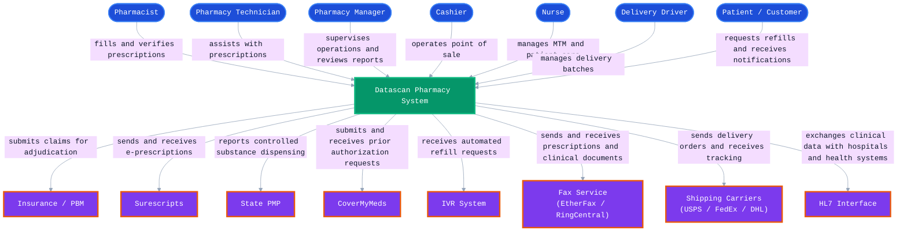

# C4 Level 1 — System Context: Datascan Pharmacy System

## Diagram

---

## People

| Actor | What They Do | Where We Found It |
|---|---|---|
| **Pharmacist** | Fills, verifies, and dispenses prescriptions. Manages patient plans, drug interactions, and claim transmissions. | `RXCHG.CBL`, `RXVERIFYP.CBL`, `RXPATMNT.CBL`, `DCSLOGIN.CBL`, `INTCHG.CBL` in `Integration/` |
| **Pharmacy Technician** | Assists the pharmacist with filling prescriptions, data entry, and workflow tasks. | `RXPHSCD.CBL`, `EMPTRACK.COB`, `EMPDASHB.COB` in `newsourc/PANELS/` |
| **Pharmacy Manager** | Supervises daily operations, reviews end-of-day reports, monitors profitability and compliance. | `EndOfDayForm.cs` in `POSLib/`, `RXPROFIT.CBL`, `DAILYTOT.COB`, `MONTHTOT.COB` in `newsourc/` |
| **Cashier** | Operates the point-of-sale register, processes payments, and handles customer transactions. | `POSRegister.cs`, `POSForm.cs`, `TillForm.cs`, `CompleteInvoiceForm.cs` in `POSLib/` |
| **Nurse** | Manages medication therapy management (MTM) and patient care plans. | `NURSMAIN.COB`, `NURSFCMT.COB` in `newsourc/PANELS/`, `RXNURMNT.CBL`, `RXNURFC.CBL` in `newsourc/` |
| **Delivery Driver** | Manages delivery batches, confirms deliveries, and accesses batch information via delivery device portal. | `DeliveryFunctions.cs`, `DeliveryDevicePortal.cs` in `POS-main/Workflow/WorkflowManager/Delivery/` |
| **Patient / Customer** | Requests refills, receives SMS notifications, and interacts via mobile app. | `DCSFunctionLib/Functions/Mobile/` in `Winpharm-main/src/DCSGUI/` |

---

## External Systems

| System | What It Exchanges with Datascan | Where We Found It |
|---|---|---|
| **Insurance / PBM** | Receives real-time prescription claims via NCPDP protocol and returns adjudication responses (approved, rejected, price). | `RXSCTGCC.CBL`, `RXNCPDP.CBL` in `newsourc/`, `INTSCTGCC.CBL` in `Integration/`, `NCPDPLST.COB` in `newsourc/PANELS/` |
| **Surescripts** | Sends and receives electronic prescriptions (eRx). Enables prescribers to send orders directly into the pharmacy system. | `Surescripts/` module in `Winpharm-main/src/`, `RXSSLINK.CBL`, `RXSSPATH.CBL` in `newsourc/` |
| **State PMP** | Receives mandatory reports of controlled substance dispensing as required by state law (ASAP format). | `PMPGateway/`, `PMPlink/` in `POS-main/`, `ASAP3.CBL`, `ASAP4.CBL`, `ASAP5.CBL` in `newsourc/` |
| **CoverMyMeds** | Receives prior authorization requests and returns approval or denial responses. | `CoverMyMeds/CMM.cs`, `CMMActions.cs` in `Winpharm-main/src/CoverMyMeds/` |
| **IVR System** | Receives automated refill requests from patients via phone and returns confirmation. | `IVRHost/` in `Winpharm-main/src/IVRHost/` |
| **Fax Service** (EtherFax / RingCentral) | Sends and receives prescriptions and clinical documents to and from prescribers. | `FaxClient/FaxAPI_EtherFax.cs`, `RingCentralClient` in `Winpharm-main/src/FaxClient/` |
| **Shipping Carriers** (USPS / FedEx / DHL) | Receives delivery orders from the pharmacy and returns tracking information. | `ShippingAPI/` in `Winpharm-main/src/`, `ShippingLib/` in `POS-main/` |
| **HL7 Interface** | Exchanges clinical data with hospitals and health systems using the HL7 standard. | `HL7/HL7Interface/`, `HL7/HL7X12/`, `HL7/X12/` in `Winpharm-main/src/HL7/` |
