# C4 Level 2 — Container Diagram: Datascan Pharmacy System

---

## AS-IS (Current State)

```mermaid
%%{init: {'theme':'base','themeVariables':{
'background':'#0f172a',
'primaryTextColor':'#334155',
'primaryBorderColor':'#334155',
'lineColor':'#94a3b8',
'fontFamily':'JetBrains Mono, monospace'
}}}%%

graph TD
    Pharmacist(["Pharmacist"])
    Technician(["Pharmacy Technician"])
    Manager(["Pharmacy Manager"])
    Cashier(["Cashier"])
    Nurse(["Nurse"])
    Driver(["Delivery Driver"])
    Patient(["Patient / Customer"])

    subgraph Datascan Pharmacy System
        WinpharmApp["Winpharm Application\n[COBOL + ScreenIO]"]
        POSApp["POS Application\n[WinForms .NET]"]
        COBOLBridge["COBOL DLL Bridge\n[Compiled COBOL DLLs]"]
        DotNetLayer["Datascan .NET Layer\n[C# net48 / net8]"]
        SharedLib["SharedCobolLib\n[C# — COBOL structs]"]
        ISAM["ISAM File System\n[RM/COBOL — 33 RX* files]"]
        MySQL["MySQL Database\n[POS data]"]
    end

    PBM["Insurance / PBM"]
    Surescripts["Surescripts"]
    PMP["State PMP"]
    CoverMyMeds["CoverMyMeds"]
    IVR["IVR System"]
    Fax["Fax Service"]
    Shipping["Shipping Carriers"]
    HL7["HL7 Interface"]
    PaymentNetwork["Payment Network"]
    QuickBooks["QuickBooks"]

    Pharmacist -->|fills and verifies prescriptions| WinpharmApp
    Technician -->|assists with prescriptions| WinpharmApp
    Manager -->|reviews reports| WinpharmApp
    Manager -->|supervises operations| POSApp
    Cashier -->|operates point of sale| POSApp
    Nurse -->|manages MTM and patient care| WinpharmApp
    Driver -->|manages delivery batches| POSApp
    Patient -->|requests refills| WinpharmApp

    WinpharmApp -->|calls| COBOLBridge
    POSApp -->|calls via RXDCSPOS.dll| COBOLBridge
    POSApp -->|uses| DotNetLayer
    DotNetLayer -->|wraps| COBOLBridge
    DotNetLayer -->|uses| SharedLib
    COBOLBridge -->|reads/writes| ISAM
    POSApp -->|reads/writes| MySQL

    WinpharmApp -->|submits claims| PBM
    WinpharmApp -->|sends/receives eRx| Surescripts
    WinpharmApp -->|reports controlled substances| PMP
    WinpharmApp -->|prior authorization requests| CoverMyMeds
    WinpharmApp -->|receives refill requests| IVR
    WinpharmApp -->|sends/receives clinical docs| Fax
    POSApp -->|sends delivery orders| Shipping
    DotNetLayer -->|exchanges clinical data| HL7
    POSApp -->|processes payments| PaymentNetwork
    POSApp -->|sends financial transactions| QuickBooks

    classDef actor fill:#1d4ed8,color:#ffffff,stroke:#3b82f6,stroke-width:2px
    classDef app fill:#0f766e,color:#ffffff,stroke:#14b8a6,stroke-width:2px
    classDef bridge fill:#7c3aed,color:#ffffff,stroke:#a78bfa,stroke-width:2px
    classDef dotnet fill:#2563eb,color:#ffffff,stroke:#60a5fa,stroke-width:2px
    classDef shared fill:#475569,color:#ffffff,stroke:#94a3b8,stroke-width:2px
    classDef data fill:#92400e,color:#ffffff,stroke:#f59e0b,stroke-width:2px
    classDef external fill:#be123c,color:#ffffff,stroke:#fb7185,stroke-width:2px

    class Pharmacist,Technician,Manager,Cashier,Nurse,Driver,Patient actor
    class WinpharmApp,POSApp app
    class COBOLBridge bridge
    class DotNetLayer dotnet
    class SharedLib shared
    class ISAM,MySQL data
    class PBM,Surescripts,PMP,CoverMyMeds,IVR,Fax,Shipping,HL7,PaymentNetwork,QuickBooks external
```

---

<strong>Winpharm Application — COBOL + ScreenIO</strong>

The core clinical system. Built entirely in COBOL with a GUI powered by ScreenIO (Greenhouse Software, Runtime Rev 9, Serial 5229). Contains all pharmacy clinical logic: filling prescriptions, patient management, drug interactions, claim transmission, auto-refill, compounding, labeling, and more.

| Property | Detail | Evidence |
|---|---|---|
| **Technology** | RM/COBOL + ScreenIO GS Runtime Rev 9 | `MAIN.COB` — `RuntimeRev: 9`, `Serial#: 5229` |
| **UI Type** | ScreenIO panels — GUI windows rendered by GS runtime | `newsourc/PANELS/` — ~300 `.COB` panel definition files |
| **Programs** | ~400 COBOL programs covering all clinical domains | `newsourc/` — `RXCHG.CBL`, `RXPATMNT.CBL`, `RXLABEL.CBL`, etc. |
| **Entry Point** | `HOMEMAIN` panel loaded by ScreenIO runtime | `HOMEMAIN.app`, `HOMEMAIN.fl` in `application files/` |
| **Data Access** | Direct COBOL ISAM file calls (`CALL RX5FILE`, etc.) | `WORKFLOW.CBL` — references RX1FILE through RX88FILE |
| **UI Communication** | `CALL 'GS'` sends/receives events via EVENT-ID | `SETPLAN.CBL`, `RXDCSPOS.CBL` — `CALL GS USING MAINPOS-1...` |
| **Active Development** | `PATIENT.COB` Panel Ver. 497, last generated 23/FEB/2026 | `newsourc/PANELS/PATIENT.COB` |
| **Clinical Domains** | Prescriptions, Patients, Insurance, Transmit, Auto-Refill, Compounding, Labels, Nurse/MTM, Workflow, HL7, Immunizations | `newsourc/` file inventory |

---

<strong>POS Application — WinForms .NET</strong>

The point-of-sale system. Built with Windows Forms in C# .NET. Handles all commercial operations: checkout, payments, inventory, customer accounts, end-of-day reporting. Does NOT have its own patient database — it reads patient data from Winpharm's ISAM files via `RXDCSPOS.dll`.

| Property | Detail | Evidence |
|---|---|---|
| **Technology** | C# .NET, Windows Forms | `POSLib.csproj` — `UseWindowsForms: true`, `TargetFrameworks: net8-windows;net48` |
| **UI Type** | WinForms screens | `POSLib/` — ~100 `.cs` + `.Designer.cs` form pairs |
| **Entry Point** | `POSForm` / `POSControl` — main shell | `POSForm.cs`, `POSControl.cs` in `POSLib/` |
| **Patient Data** | Calls `RXDCSPOS.dll` — reads Winpharm ISAM directly | `RXDCSPOS.CBL` — `S_GET_PATIENT_INFO`, `S_PATIENT_SEARCH`, `S_GET_PATIENT_PLAN` |
| **Own Data Store** | MySQL via `POSDatabase` project | `POSCobolLib.csproj` — references `POSDatabase.csproj` |
| **Shared Code** | References `SharedCobolLib` from Winpharm source path | `POSCobolLib.csproj` — `..\..\Winpharm\src\WinpharmDatabase\SharedCobolLib` |
| **Payment Hardware** | Ingenico RBA terminal, Topaz signature pad | `Lib/RBA_SDK.dll`, `Lib/SigPlusNET.dll` |
| **Accounting** | QuickBooks integration | `Lib/Interop.QBXMLRP2.dll`, `QuickBooksLib.cs` in `POSLib/` |
| **Auth** | DigitalPersona fingerprint | `Lib/DPCtlUruNet.dll`, `FingerprintAuth/` in Winpharm |
| **Commercial Domains** | Checkout, Payments, Inventory, Accounts, Reports, Employees, Shipping, Gift Cards | `POSLib/` file inventory |

---

<strong>COBOL DLL Bridge — Compiled COBOL DLLs</strong>

COBOL programs compiled as Windows DLLs. These are the tightest coupling point in the system. They contain business logic that both Winpharm and POS call via `DllImport` from C#. Source code exists in `newsourc/Integration/`.

| DLL | Responsibility | COBOL Source | Called By |
|---|---|---|---|
| `WORKFLOW.DLL` | Central hub — all ISAM file access, Winpharm↔POS bridge | `WORKFLOW.CBL` | `POSCobolLib` via `DllImport` |
| `RXDCSPOS.dll` | Patient data access for POS (12 entry points) | `RXDCSPOS.CBL` | `POSCobolLib` — `S_GET_PATIENT_INFO`, etc. |
| `DCSGUIINT.dll` | Print label, transmit claim, display response | `DCSGUIINT.CBL` | `CobolInteropService` via `DllImport` |
| `INTCHG.dll` | Open Fill Prescription screen (COBOL UI) | `INTCHG.CBL` | `CobolInteropService.OpenRxEditScreen()` |
| `INTSCTGCC.dll` | Transmit claim, reverse claim | `INTSCTGCC.CBL` | `CobolInteropService.OpenTransmitScreen()` |
| `INTINTERAC.dll` | Drug interaction check | `INTINTERAC.CBL` | `CobolInteropService.InteractionCheck()` |
| `INTDSPRSP.dll` | Display response screen | `INTDSPRSP.CBL` | `CobolInteropService.OpenDisplayResponseScreen()` |
| `WEBAPI.dll` | Exposes prescription data to external web services | `WEBAPI.CBL` | External web consumers via HTTP |

---

<strong>Datascan .NET Layer — C# net48 / net8</strong>

The partial .NET migration layer inside Winpharm. Contains the architectural foundation (Clean Architecture) that will grow to replace COBOL components progressively. Currently wraps COBOL DLL calls behind interfaces.

| Project | Responsibility | Key Dependencies | Evidence |
|---|---|---|---|
| `Datascan.Winpharm.Core` | Domain models, repository interfaces, enums | None | `IPrescriptionRepository.cs`, `IAutoRefillRepository.cs` |
| `Datascan.Winpharm.Application` | Application services, state management | Core + Interop + SharedCobolLib | `PrescriptionService.cs`, `SchedulerService.cs` |
| `Datascan.Winpharm.Interop` | Wraps all DllImport calls behind `ICobolInteropService` | SharedCobolLib | `CobolInteropService.cs` — 7 DllImport methods |
| `Datascan.Winpharm.Database` | Repository implementations, data access | Core | `Repositories/` folder |
| `Datascan.Winpharm.Wpf` | WPF UI — 1 screen migrated (AutoRefillResults) | Application + Core + Database + Interop | `AutoRefillResultsWindow.xaml`, CommunityToolkit.Mvvm |
| `Datascan.POS.Core` | POS domain interfaces and models | None | `IVendor.cs`, `PrescriptionKitModel.cs` |
| `Datascan.POS.Services` | POS application services | Core | `CheckoutService.cs`, `PrescriptionKitService.cs` |
| `Datascan.POS.Tests` | Existing test suite for POS services | xUnit | `CheckoutServiceTests.cs`, `PrescriptionKitTests.cs` |
| `Datascan.POS.UI.Wpf` | WPF UI — 1 screen migrated (PrescriptionKitMaintenance) | Core | `PrescriptionKitMaintenanceWindow.xaml` |

---

<strong>SharedCobolLib — C# COBOL Struct Bridge</strong>

A C# library that mirrors COBOL memory layouts as C# structs. Used by both Winpharm and POS as the data contract between .NET code and COBOL DLL calls. Not a domain model — it is a byte-level translation layer.

| Property | Detail | Evidence |
|---|---|---|
| **Technology** | C# .NET — `StructLayout`, `MarshalAs` attributes | `SharedCobolLib.csproj` in Winpharm source |
| **Purpose** | Maps COBOL PIC X / PIC 9 / COMP-3 fields to C# structs | `CobolInteropService.cs` — `LabelFld`, `PHS_Info`, `RxRfKey`, `TransmitLinkVariable` |
| **Physical Location** | Lives in Winpharm repo | `Winpharm-main/src/WinpharmDatabase/SharedCobolLib/` |
| **Shared By** | Both Winpharm and POS reference it | `POSCobolLib.csproj` — `..\..\Winpharm\src\WinpharmDatabase\SharedCobolLib` |
| **Migration Impact** | Must be replaced with clean C# domain models per component | `StandAlonePlan` — `Plan.cs`, `PlanSelectionResult.cs` replace COBOL structs |

---

<strong>ISAM File System — RM/COBOL Indexed Sequential Files</strong>

The primary data store for all clinical data in Winpharm. Not a relational database — indexed sequential files accessed only through COBOL subprogram calls. Shared between Winpharm and POS via the COBOL DLL Bridge.

| Property | Detail | Evidence |
|---|---|---|
| **Technology** | RM/COBOL ISAM — indexed sequential access method | `WORKFLOW.CBL` — `CALL RX5FILE USING FILE-REQUEST PR5` |
| **File Count** | 33+ indexed files referenced in WORKFLOW.CBL alone | `WORKFLOW.CBL` — RX1FILE through RX88FILE |
| **Key Files** | RX1FILE (pharmacy config), RX5FILE (patients), RX11FILE (plan master), RX18FILE (patient-plan) | `SETPLAN.CBL`, `RXDCSPOS.CBL`, `WORKFLOW.CBL` |
| **Access Pattern** | COBOL programs call file subprograms: `CALL RX5FILE USING FILE-REQUEST PR5` | All COBOL programs in `newsourc/` |
| **Shared Access** | POS reads patient ISAM data via `RXDCSPOS.dll` | `RXDCSPOS.CBL` — opens RX5FILE, RX18FILE directly |
| **Migration Impact** | Each ISAM file maps to a future database table or repository | `MockPlanRepository.cs` — simulates RX5, RX11, RX18 with C# dictionaries |

---

<strong>MySQL Database — POS Data Store</strong>

Relational database used by POS for commercial data. Separate from Winpharm's ISAM files. Contains POS-specific data: accounts, inventory, invoices, transactions.

| Property | Detail | Evidence |
|---|---|---|
| **Technology** | MySQL | `Lib/MySql.Data.dll` in POS |
| **Access Layer** | `POSDatabase` project | `POSCobolLib.csproj` — references `POSDatabase.csproj` |
| **Data Scope** | POS commercial data — accounts, inventory, transactions | `POSDatabase/` project, `DbAccess/` in POS |
| **Not Shared** | Winpharm does not use MySQL — uses ISAM only | No MySQL reference in Winpharm projects |

---
---

## TO-BE (Target State — Migration)

```mermaid
%%{init: {'theme':'base','themeVariables':{
'background':'#0f172a',
'primaryTextColor':'#334155',
'primaryBorderColor':'#334155',
'lineColor':'#94a3b8',
'fontFamily':'JetBrains Mono, monospace'
}}}%%

graph TD
    Pharmacist(["Pharmacist"])
    Technician(["Pharmacy Technician"])
    Manager(["Pharmacy Manager"])
    Cashier(["Cashier"])
    Nurse(["Nurse"])
    Driver(["Delivery Driver"])
    Patient(["Patient / Customer"])

    subgraph Datascan Pharmacy System
        WinpharmWPF["Winpharm WPF Application\n[C# WPF — Clean Architecture]"]
        POSWPF["POS WPF Application\n[C# WPF — Clean Architecture]"]
        AppServices["Application Services Layer\n[C# — Use Cases / Business Logic]"]
        RepoLayer["Repository Layer\n[C# — replaces COBOL DLL calls]"]
        COBOLBridge["COBOL DLL Bridge\n[Transitional — Strangler Fig]"]
        Database["Database\n[SQL — replaces ISAM]"]
    end

    PBM["Insurance / PBM"]
    Surescripts["Surescripts"]
    PMP["State PMP"]
    CoverMyMeds["CoverMyMeds"]
    IVR["IVR System"]
    Fax["Fax Service"]
    Shipping["Shipping Carriers"]
    HL7["HL7 Interface"]
    PaymentNetwork["Payment Network"]
    QuickBooks["QuickBooks"]

    Pharmacist -->|fills and verifies prescriptions| WinpharmWPF
    Technician -->|assists with prescriptions| WinpharmWPF
    Manager -->|reviews reports| WinpharmWPF
    Manager -->|supervises operations| POSWPF
    Cashier -->|operates point of sale| POSWPF
    Nurse -->|manages MTM and patient care| WinpharmWPF
    Driver -->|manages delivery batches| POSWPF
    Patient -->|requests refills| WinpharmWPF

    WinpharmWPF -->|calls| AppServices
    POSWPF -->|calls| AppServices
    AppServices -->|calls| RepoLayer
    RepoLayer -->|reads/writes| Database
    RepoLayer -.->|transitional calls| COBOLBridge
    COBOLBridge -.->|still needed during migration| Database

    WinpharmWPF -->|submits claims| PBM
    WinpharmWPF -->|sends/receives eRx| Surescripts
    WinpharmWPF -->|reports controlled substances| PMP
    WinpharmWPF -->|prior authorization requests| CoverMyMeds
    WinpharmWPF -->|receives refill requests| IVR
    WinpharmWPF -->|sends/receives clinical docs| Fax
    POSWPF -->|sends delivery orders| Shipping
    AppServices -->|exchanges clinical data| HL7
    POSWPF -->|processes payments| PaymentNetwork
    POSWPF -->|sends financial transactions| QuickBooks

    classDef actor fill:#1d4ed8,color:#ffffff,stroke:#3b82f6,stroke-width:2px
    classDef ui fill:#0f766e,color:#ffffff,stroke:#14b8a6,stroke-width:2px
    classDef services fill:#2563eb,color:#ffffff,stroke:#60a5fa,stroke-width:2px
    classDef repo fill:#7c3aed,color:#ffffff,stroke:#a78bfa,stroke-width:2px
    classDef bridge fill:#b45309,color:#ffffff,stroke:#f59e0b,stroke-width:2px
    classDef data fill:#92400e,color:#ffffff,stroke:#fbbf24,stroke-width:2px
    classDef external fill:#be123c,color:#ffffff,stroke:#fb7185,stroke-width:2px

    class Pharmacist,Technician,Manager,Cashier,Nurse,Driver,Patient actor
    class WinpharmWPF,POSWPF ui
    class AppServices services
    class RepoLayer repo
    class COBOLBridge bridge
    class Database data
    class PBM,Surescripts,PMP,CoverMyMeds,IVR,Fax,Shipping,HL7,PaymentNetwork,QuickBooks external
```

---

<strong>Winpharm WPF Application — C# WPF Clean Architecture</strong>

Replaces Winpharm COBOL + ScreenIO entirely. Each COBOL screen is migrated independently following the StandAlonePlan pattern. No ScreenIO dependency — fully testable with FlaUI.

| Property | Detail | Proof of Concept |
|---|---|---|
| **Technology** | C# WPF, .NET 4.8 / net8.0-windows | `StandAlonePlan` — `Datascan.Winpharm.Wpf.csproj` (`UseWPF: true`) |
| **Architecture** | Clean Architecture — UI / ViewModel / UseCase / Repository | `StandAlonePlan` — 4-layer structure |
| **UI Pattern** | MVVM with CommunityToolkit.Mvvm | `StandAlonePlan` — `PlanSelectionViewModel.cs` |
| **DI** | Microsoft.Extensions.DependencyInjection | `StandAlonePlan` — `App.xaml.cs` composition root |
| **Testability** | Unit tests (xUnit + Moq) + E2E tests (FlaUI) | `StandAlonePlan.Tests/` — 6 test files |
| **Migration Unit** | One COBOL screen = one WPF feature | `PLANSLCT.COB` → `PlanSelectionWindow.xaml` |

---

<strong>POS WPF Application — C# WPF Clean Architecture</strong>

Replaces POSLib WinForms entirely. Each WinForms screen is migrated independently. Follows the same pattern as Winpharm WPF migration.

| Property | Detail | Evidence |
|---|---|---|
| **Technology** | C# WPF, net8.0-windows | `Datascan.POS.UI.Wpf.csproj` — migration already started |
| **Migration Started** | 1 screen migrated: `PrescriptionKitMaintenanceWindow` | `Datascan.POS.UI.Wpf/` — `PrescriptionKitMaintenanceWindow.xaml` |
| **Architecture** | Clean Architecture — same pattern as Winpharm WPF | `Datascan.POS.Core` + `Datascan.POS.Services` already exist |
| **Migration Unit** | One WinForms form = one WPF feature | `POSLib/` — ~100 forms to migrate |

---

<strong>Application Services Layer — C# Use Cases</strong>

Contains all business logic migrated from COBOL. Each COBOL paragraph or subprogram becomes a C# Use Case class. Shared between Winpharm WPF and POS WPF.

| Property | Detail | Proof of Concept |
|---|---|---|
| **Technology** | C# .NET class library | `StandAlonePlan` — `Features/PlanSelection/Domain/UseCases/` |
| **Pattern** | One Use Case per business operation | `GetPatientPlansUseCase`, `SelectPlanUseCase`, `AddPlanUseCase`, `PaginatePlansUseCase` |
| **COBOL Origin** | Each use case replaces COBOL paragraphs | `SETPLAN.CBL` → 4 use cases in StandAlonePlan |
| **Testable** | No UI dependency — pure C# logic | `StandAlonePlan.Tests/` — `GetPatientPlansUseCaseTests.cs` |

---

<strong>Repository Layer — C# Data Access</strong>

Replaces all COBOL DLL calls and ISAM file access with C# repository implementations. Each ISAM file maps to a repository interface and implementation.

| Property | Detail | Proof of Concept |
|---|---|---|
| **Technology** | C# .NET — interface + implementation pattern | `StandAlonePlan` — `IPlanRepository` + `MockPlanRepository` |
| **Replaces** | `CALL RX5FILE`, `CALL RX11FILE`, `CALL RX18FILE` COBOL patterns | `MockPlanRepository.cs` — simulates RX5, RX11, RX18 with dictionaries |
| **Switch to Real** | Single DI registration change: `Mock` → `Real` | `App.xaml.cs` — `services.AddSingleton<IPlanRepository, MockPlanRepository>()` |
| **Existing Interfaces** | `IPrescriptionRepository`, `IAutoRefillRepository` | `Datascan.Winpharm.Core/Repositories/` |

---

<strong>COBOL DLL Bridge — Transitional (Strangler Fig)</strong>

Remains during migration. Each time a component is fully migrated to C#, its corresponding DLL call is removed. The bridge shrinks progressively until it is eliminated.

| Property | Detail | Evidence |
|---|---|---|
| **Pattern** | Strangler Fig — new C# grows alongside old COBOL | `ICobolInteropService` — seam already exists in Winpharm |
| **Current Seam** | `ICobolInteropService` wraps all DllImport calls | `Datascan.Winpharm.Interop/Services/CobolInteropService.cs` |
| **First Removed** | `SETPLAN` — already replaced by StandAlonePlan | `INTCHG.dll` call for plan selection no longer needed |
| **Last Removed** | DLLs containing the most embedded business logic | `DCSGUIINT.dll`, `INTCHG.dll` — require full COBOL rewrite |

---

<strong>Database — SQL (replaces ISAM)</strong>

Replaces all 33+ ISAM files with a relational database. POS already uses MySQL — the target is to unify both systems under a single database engine.

| Property | Detail | Evidence |
|---|---|---|
| **Target Technology** | SQL — MySQL already in use by POS | `Lib/MySql.Data.dll`, `POSDatabase/` in POS |
| **Migration Unit** | One ISAM file = one or more database tables | `RX5FILE` → `patients` table, `RX18FILE` → `patient_plans` table |
| **Proof of Concept** | `MockPlanRepository` maps ISAM to C# — defines the schema | `MockPlanRepository.cs` — dictionaries model RX5, RX11, RX18 structure |
| **Existing Repositories** | `Datascan.Winpharm.Database` already has repository implementations | `Datascan.Winpharm.Database/Repositories/` |

---
---

## Interactions

<strong>01 — Pharmacist → Fills and verifies prescriptions → Winpharm Application</strong>

The Pharmacist is the primary clinical user of Winpharm. They access the system through the `HOMEMAIN` ScreenIO panel and navigate to prescription workflows. Filling a prescription invokes `RXCHG.CBL`, which orchestrates drug selection, dosage, patient validation, and insurance plan assignment. Verification is handled by `RXVERIFYP.CBL`. Drug interaction checks are performed via `INTINTERAC.dll`. Once verified, the prescription is stored in the ISAM file system via `WORKFLOW.CBL`.

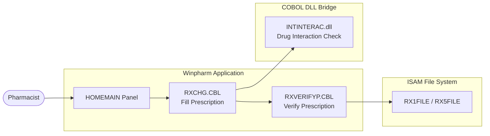

| Step | Container | Evidence |
|---|---|---|
| Login | Winpharm Application | `DCSLOGIN.CBL` |
| Navigate to fill | Winpharm Application | `HOMEMAIN` panel — `HOMEMAIN.app` |
| Fill prescription | Winpharm Application | `RXCHG.CBL` |
| Drug interaction check | COBOL DLL Bridge | `INTINTERAC.dll` → `INTINTERAC.CBL` |
| Verify prescription | Winpharm Application | `RXVERIFYP.CBL` |
| Store to ISAM | ISAM File System | `WORKFLOW.CBL` — RX1FILE, RX5FILE |

---

<strong>02 — Pharmacy Technician → Assists with prescriptions → Winpharm Application</strong>

The Pharmacy Technician operates within Winpharm under restricted permissions. They assist with data entry, prescription intake, and workflow tasks. Their activity is tracked via `EMPTRACK.COB` and they access prescription workflows through the same ScreenIO panels as the Pharmacist but with role-limited access controlled by `RXPHSCD.CBL`.

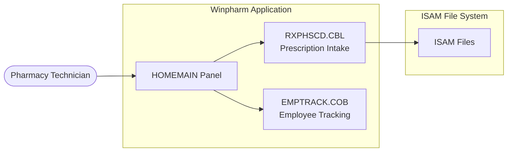

| Step | Container | Evidence |
|---|---|---|
| Login with role | Winpharm Application | `DCSLOGIN.CBL` |
| Data entry and intake | Winpharm Application | `RXPHSCD.CBL` |
| Employee tracking | Winpharm Application | `EMPTRACK.COB`, `EMPDASHB.COB` in `newsourc/PANELS/` |

---

<strong>03 — Pharmacy Manager → Supervises operations and reviews reports → Winpharm Application + POS Application</strong>

The Pharmacy Manager uses both systems. In Winpharm they review clinical profitability and compliance reports. In POS they review end-of-day financial summaries. Both systems contribute to their oversight role.

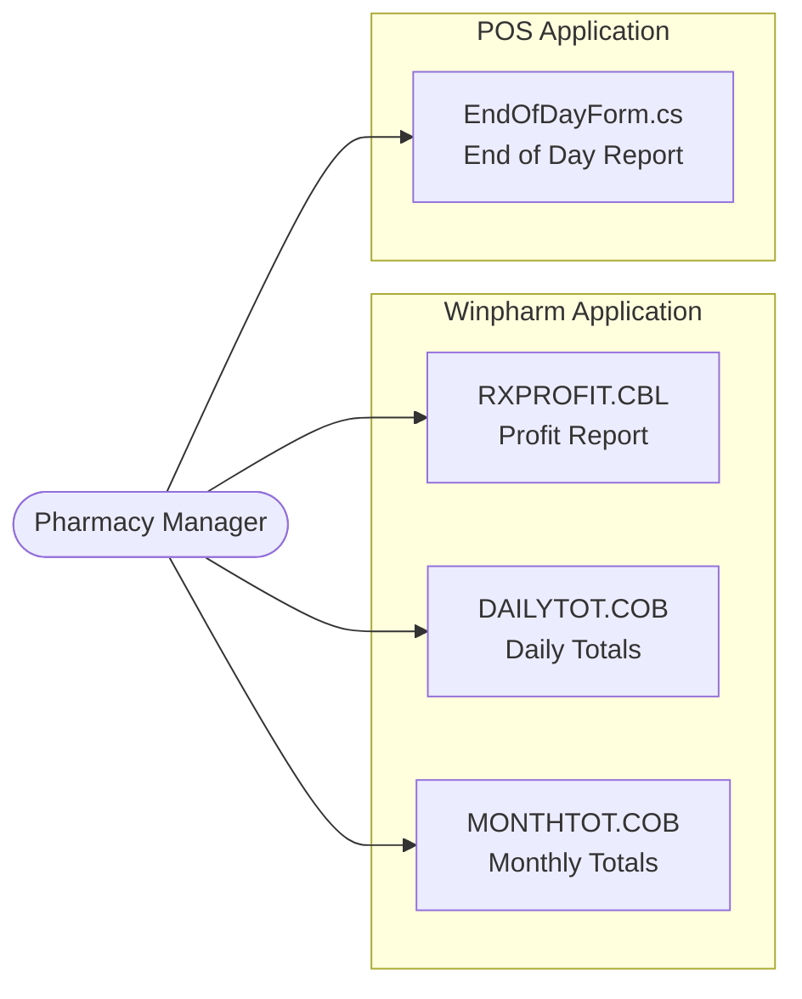

| Step | Container | Evidence |
|---|---|---|
| Clinical profit reports | Winpharm Application | `RXPROFIT.CBL`, `RXPROFITRPT.CBL` |
| Daily and monthly totals | Winpharm Application | `DAILYTOT.COB`, `MONTHTOT.COB` in `newsourc/PANELS/` |
| End of day financial report | POS Application | `EndOfDayForm.cs` in `POSLib/` |

---

<strong>04 — Cashier → Operates point of sale → POS Application</strong>

The Cashier operates exclusively within the POS Application. They process customer transactions, handle payments, open and close the till, and complete invoices. The main shell is `POSForm` which loads `POSControl` as the central register interface.

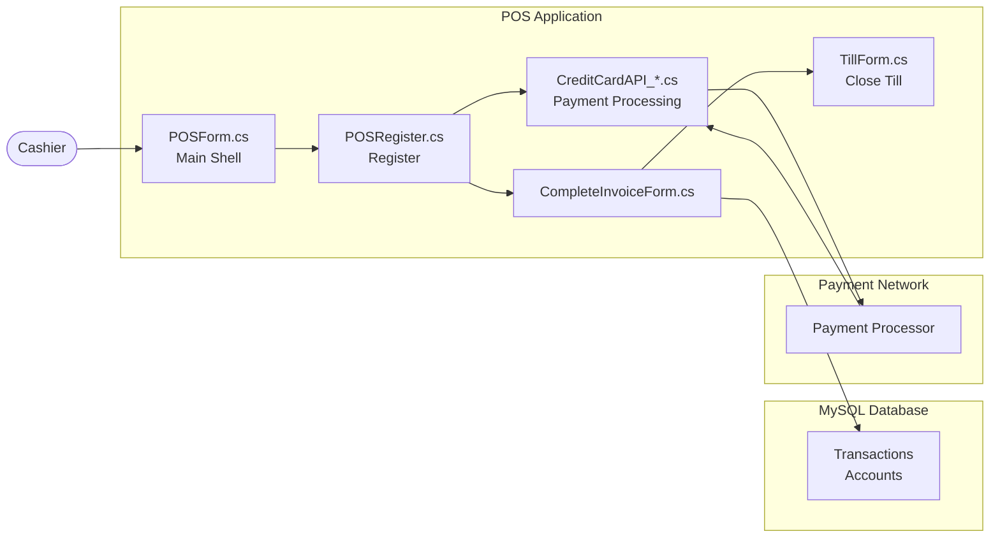

| Step | Container | Evidence |
|---|---|---|
| Open register | POS Application | `POSForm.cs`, `POSControl.cs` in `POSLib/` |
| Process transaction | POS Application | `POSRegister.cs` in `POSLib/` |
| Process payment | POS Application + Payment Network | `POSLib/PaymentTypes/CreditCardAPI_*.cs` |
| Complete invoice | POS Application | `CompleteInvoiceForm.cs` in `POSLib/` |
| Close till | POS Application | `TillForm.cs` in `POSLib/` |

---

<strong>05 — Nurse → Manages MTM and patient care → Winpharm Application</strong>

The Nurse manages Medication Therapy Management (MTM) and patient care plans within Winpharm. They access dedicated MTM panels and interact with patient care records stored in the ISAM file system.

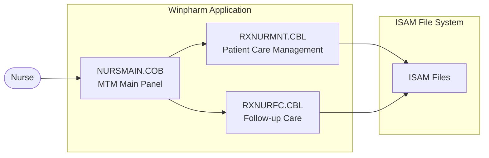

| Step | Container | Evidence |
|---|---|---|
| Access MTM module | Winpharm Application | `NURSMAIN.COB`, `NURSFCMT.COB` in `newsourc/PANELS/` |
| Manage patient care | Winpharm Application | `RXNURMNT.CBL`, `RXNURFC.CBL` in `newsourc/` |
| Store care plan | ISAM File System | `WORKFLOW.CBL` |

---

<strong>06 — Delivery Driver → Manages delivery batches → POS Application</strong>

The Delivery Driver interacts with POS through a dedicated delivery device portal. They access batch information, confirm deliveries, and update delivery status. Driver accounts are tracked in the POS database.

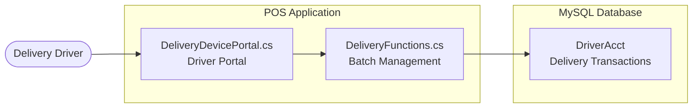

| Step | Container | Evidence |
|---|---|---|
| Access delivery portal | POS Application | `DeliveryDevicePortal.cs` in `POS-main/Workflow/` |
| Load batch | POS Application | `DeliveryFunctions.cs` — `PromptForDriver()` |
| Confirm delivery | POS Application + MySQL | `DriverAcct` field in delivery transactions |

---

<strong>07 — Patient / Customer → Requests refills and receives notifications → Winpharm Application</strong>

Patients interact with the system indirectly through automated channels — IVR phone refill requests and SMS/mobile app notifications. The Winpharm Application handles inbound refill requests and outbound patient communication via the mobile integration layer.

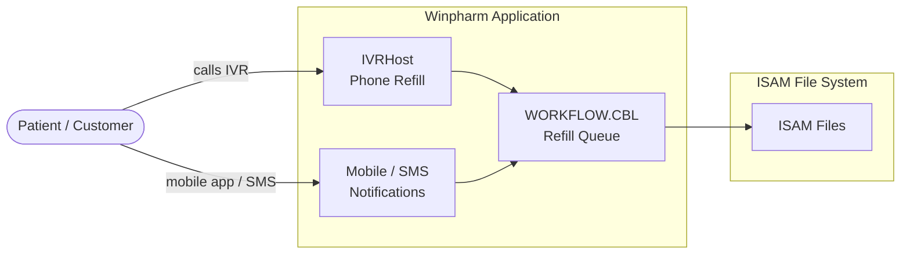

| Step | Container | Evidence |
|---|---|---|
| Request refill via phone | Winpharm Application | `IVRHost/` in `Winpharm-main/src/` |
| Request refill via mobile | Winpharm Application | `DCSFunctionLib/Functions/Mobile/` |
| Receive SMS notification | Winpharm Application | `DCSFunctionLib/Functions/Mobile/` |

---

<strong>08 — System → Submits claims for adjudication → Insurance / PBM</strong>

When a prescription is filled, Winpharm submits a real-time claim to the Insurance/PBM via the NCPDP protocol. The PBM returns an adjudication response (approved, rejected, or with alternate pricing). The transmission is handled by `RXSCTGCC.CBL` and exposed to C# via `INTSCTGCC.dll`.

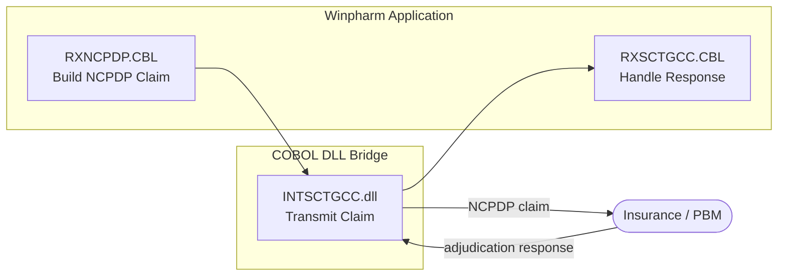

| Step | Container | Evidence |
|---|---|---|
| Build NCPDP claim | Winpharm Application | `RXNCPDP.CBL` in `newsourc/` |
| Transmit claim | COBOL DLL Bridge | `INTSCTGCC.dll` → `INTSCTGCC.CBL` |
| Receive adjudication response | Winpharm Application | `RXSCTGCC.CBL`, `NCPDPLST.COB` in `newsourc/PANELS/` |

---

<strong>09 — System → Sends and receives e-prescriptions → Surescripts</strong>

Winpharm integrates with Surescripts to send and receive electronic prescriptions (eRx) and to verify prescriber identity via the Prescriber Connect Directory. Real-time benefit checking is also available via the RealTimeBenefit module.

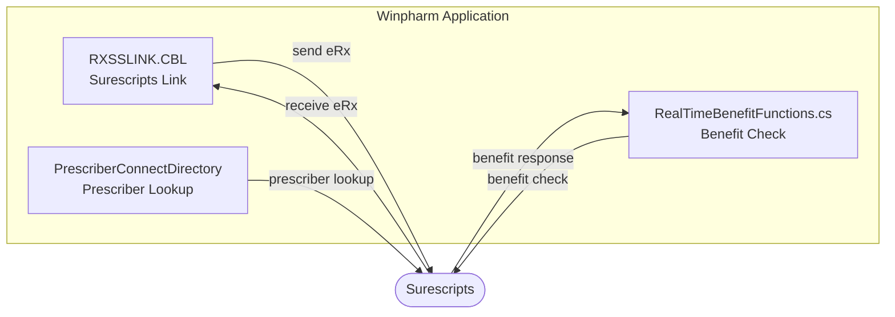

| Step | Container | Evidence |
|---|---|---|
| Receive inbound eRx | Winpharm Application | `RXSSLINK.CBL`, `RXSSPATH.CBL` in `newsourc/` |
| Send outbound eRx | Winpharm Application | `Surescripts/` module in `Winpharm-main/src/` |
| Prescriber directory lookup | Winpharm Application | `Surescripts/PrescriberConnectDirectory/` |
| Real-time benefit check | Winpharm Application | `Surescripts/RealTimeBenefitLib/RealTimeBenefitFunctions.cs` |

---

<strong>10 — System → Reports controlled substance dispensing → State PMP</strong>

Both Winpharm and POS are involved in controlled substance reporting to the State PMP. Winpharm generates ASAP-format reports via COBOL programs. POS provides the gateway and link modules to submit those reports to the state registry.

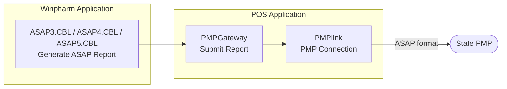

| Step | Container | Evidence |
|---|---|---|
| Generate ASAP report | Winpharm Application | `ASAP3.CBL`, `ASAP4.CBL`, `ASAP5.CBL` in `newsourc/` |
| Submit to State PMP | POS Application | `PMPGateway/`, `PMPlink/` in `POS-main/` |

---

<strong>11 — System → Submits and receives prior authorization requests → CoverMyMeds</strong>

When a prescription requires prior authorization, Winpharm submits a PA request to CoverMyMeds and receives an approval or denial response. This is handled by the CoverMyMeds integration module.

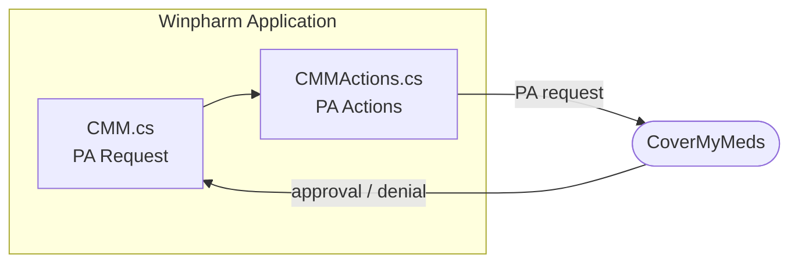

| Step | Container | Evidence |
|---|---|---|
| Submit PA request | Winpharm Application | `CoverMyMeds/CMM.cs` in `Winpharm-main/src/` |
| Execute PA actions | Winpharm Application | `CoverMyMeds/CMMActions.cs` |
| Receive PA response | Winpharm Application | `CoverMyMeds/CMM.cs` |

---

<strong>12 — System → Receives automated refill requests → IVR System</strong>

Patients can call an automated IVR phone system to request prescription refills. The IVR communicates with Winpharm via TCP to submit refill requests which are then queued for pharmacist review.

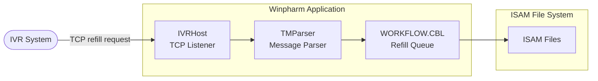

| Step | Container | Evidence |
|---|---|---|
| Receive IVR refill request | Winpharm Application | `IVRHost/` in `Winpharm-main/src/` |
| Parse IVR message | Winpharm Application | `IVRHost/TMParser` |
| Queue refill for review | ISAM File System | `WORKFLOW.CBL` |

---

<strong>13 — System → Sends and receives prescriptions and clinical documents → Fax Service</strong>

Winpharm sends and receives prescriptions and clinical documents via fax. Two fax providers are supported: EtherFax and RingCentral. Inbound faxes from prescribers are received and attached to prescription records.

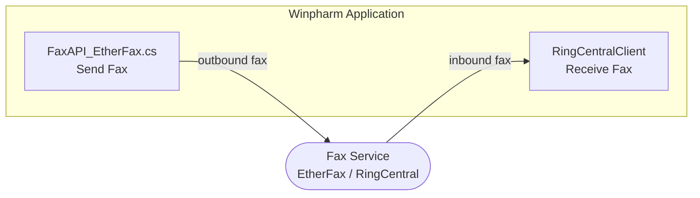

| Step | Container | Evidence |
|---|---|---|
| Send fax | Winpharm Application | `FaxClient/FaxAPI_EtherFax.cs` in `Winpharm-main/src/` |
| Receive inbound fax | Winpharm Application | `FaxClient/RingCentralClient` in `Winpharm-main/src/` |

---

<strong>14 — System → Sends delivery orders and receives tracking → Shipping Carriers</strong>

Both Winpharm and POS integrate with shipping carriers for prescription delivery. Winpharm handles address verification and carrier selection. POS handles label generation and tracking via FedEx, USPS, and DHL integrations.

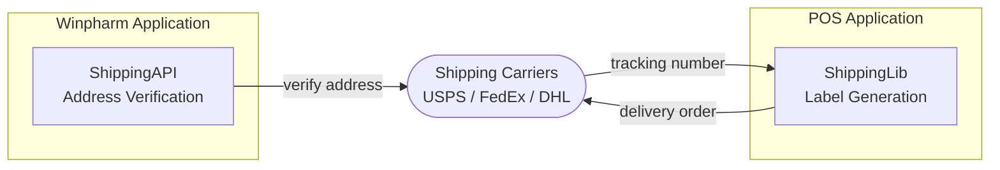

| Step | Container | Evidence |
|---|---|---|
| Verify address | Winpharm Application | `ShippingAPI/` in `Winpharm-main/src/` |
| Generate shipping label | POS Application | `ShippingLib/` in `POS-main/` |
| Submit delivery order | POS Application | FedEx WSDL, Stamps.com API in `ShippingLib/` |
| Receive tracking number | POS Application | `ShippingLib/` — Scanovator carrier selection |

---

<strong>15 — System → Exchanges clinical data with hospitals and health systems → HL7 Interface</strong>

Winpharm exchanges clinical data with hospitals and health systems using the HL7 standard. The HL7 module supports multiple message types and X12 transactions for interoperability with external clinical systems.

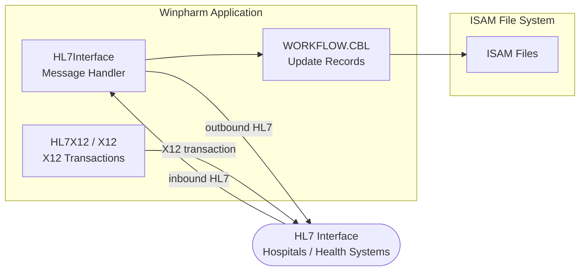

| Step | Container | Evidence |
|---|---|---|
| Send HL7 message | Winpharm Application | `HL7/HL7Interface/` in `Winpharm-main/src/` |
| Receive HL7 message | Winpharm Application | `HL7/HL7Interface/` in `Winpharm-main/src/` |
| X12 transaction processing | Winpharm Application | `HL7/HL7X12/`, `HL7/X12/` in `Winpharm-main/src/` |
| Update clinical records | ISAM File System | `WORKFLOW.CBL` |

---

<strong>16 — System → Processes payment transactions → Payment Network</strong>

The POS Application processes credit card and payment transactions at checkout through multiple payment processor integrations. The active processor is configured per pharmacy. All processors share the same interface pattern in `POSLib/PaymentTypes/`.

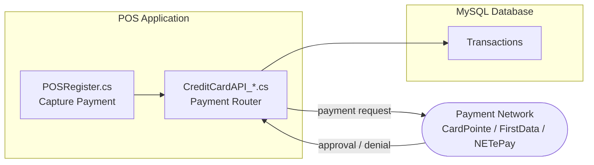

| Step | Container | Evidence |
|---|---|---|
| Capture payment at register | POS Application | `POSRegister.cs` in `POSLib/` |
| Route to active processor | POS Application | `POSLib/PaymentTypes/CreditCardAPI_CardPointe.cs`, `CreditCardAPI_FirstData.cs`, `CreditCardAPI_NETePay.cs` |
| Receive approval / denial | POS Application | Response handled in `POSLib/PaymentTypes/` |
| Record transaction | MySQL Database | `POSDatabase/` project |

---

<strong>17 — System → Sends financial transactions → QuickBooks</strong>

At end of day, the POS Application synchronizes invoice and transaction data to QuickBooks via the XML-RPC protocol. This allows the pharmacy to maintain accounting records in QuickBooks without manual data entry.

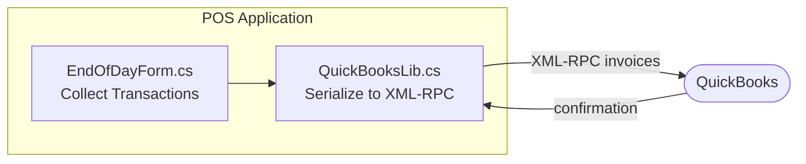

| Step | Container | Evidence |
|---|---|---|
| Collect end of day transactions | POS Application | `EndOfDayForm.cs` in `POSLib/` |
| Serialize to QuickBooks format | POS Application | `QuickBooksLib.cs` in `POSLib/` |
| Send via XML-RPC | POS Application | `Lib/Interop.QBXMLRP2.dll` in `POS-main/` |
| Receive confirmation | POS Application | `QuickBooksLib.cs` |

