# C3-AS-01 — Component Diagram: Winpharm Application (AS-IS)

**Container:** Winpharm Application
**Technology:** COBOL + ScreenIO (GS Runtime Rev 9, Serial 5229)
**Programs:** ~671 COBOL programs + 373 ScreenIO panels
**Source:** `Winpharm-main/newsourc/` + `Winpharm-main/newsourc/PANELS/`

---

## Diagram

```mermaid
%%{init: {
  "theme": "base",
  "flowchart": {
    "curve": "basis",
    "nodeSpacing": 38,
    "rankSpacing": 55,
    "padding": 18
  },
  "themeVariables": {
    "background": "#0b1020",
    "primaryTextColor": "#e5e7eb",
    "secondaryTextColor": "#cbd5e1",
    "tertiaryTextColor": "#94a3b8",
    "lineColor": "#94a3b8",
    "primaryBorderColor": "#334155",
    "clusterBorder": "#475569",
    "fontFamily": "Inter, Segoe UI, Roboto, JetBrains Mono, monospace",
    "fontSize": "14px"
  }
}}%%

flowchart TD

    %% =========================
    %% APP PRINCIPAL
    %% =========================
    subgraph WinpharmApp["🏥 Winpharm Application"]
        direction TB

        Entry["🚪 Entry Point<br/><b>HOMEMAIN / MAIN.COB</b><br/>ScreenIO GS Runtime"]

        subgraph Clinical["🩺 Clinical Core"]
            direction TB
            Rx["💊 <b>Prescription & Dispensing</b><br/>RXCHG / RXFIL / RXVERIFY<br/>DISPENSE / RXDISP<br/><i>~125 programs</i>"]
            Patient["🧑‍⚕️ <b>Patient Management</b><br/>RXPATMNT / PATIENT<br/>PATLIST / PATINS<br/><i>~45 programs</i>"]
            Drug["🧪 <b>Drug & Medication</b><br/>RXDRG / DRUGMAIN<br/>INTERAC / DOSEINFO<br/><i>~50 programs</i>"]
            Insurance["🛡️ <b>Insurance & Claims</b><br/>RXINS / RXNCPDP<br/>RXSCTGCC / RXELG<br/><i>~40 programs</i>"]
        end

        subgraph Specialized["⭐ Specialized Care"]
            direction TB
            NursingHome["🏡 <b>Nursing Home / MTM</b><br/>RXNURMNT / NURSMAIN<br/>CAREPLAN / NHPRTCHG<br/><i>~20 programs</i>"]
            Adherence["📋 <b>Adherence & Compliance</b><br/>RXADH / ADHRDASH<br/>AUDITRX / CMPLOGOP<br/><i>~27 programs</i>"]
            Immunization["💉 <b>Immunization</b><br/>RXIMMUN / IMMNHIST<br/>RXVAC / IMMNTASK<br/><i>~10 programs</i>"]
        end

        subgraph Operations["⚙️ Operations"]
            direction TB
            Workflow["🔄 <b>Workflow & Tasks</b><br/>RXWF / WRKFLOW<br/>TASKLIST / WFBATCH<br/><i>~20 programs</i>"]
            Reporting["🖨️ <b>Reporting & Printing</b><br/>RXLBL / RXRP<br/>LABELPRT / PATPRINT<br/><i>~30 programs</i>"]
            Billing["💰 <b>Billing & Financial</b><br/>RXPAY / RXPRC<br/>PAYMENT / PROFIT<br/><i>~25 programs</i>"]
            Inventory["📦 <b>Inventory</b><br/>RXINV / RXQOH<br/>ADJSTQOH / SPLITLOT<br/><i>~15 programs</i>"]
        end

        subgraph Integrations["🔌 External Integrations"]
            direction TB
            HL7["🧬 <b>HL7 / FHIR</b><br/>RXHL7 / HL7MSG<br/>FHIRADD / MARHL7"]
            Surescripts["📨 <b>Surescripts / eRx</b><br/>RXSSLINK / RXSSPATH<br/>NCPDPLST / NCPDPADD"]
            PMP["🔐 <b>State PMP</b><br/>ASAP3 / ASAP4 / ASAP5<br/>EPCSAUDT / EPCSLOG"]
            Fax["📠 <b>Fax</b><br/>RXFAX / FAXCLIENT<br/>FaxAPI_EtherFax"]
            CoverMyMeds["🧾 <b>CoverMyMeds / PA</b><br/>RXELG / MANADJUD<br/>CMM.cs"]
            IVR["📞 <b>IVR / Auto-Refill</b><br/>RXMUL / AUTORXQ<br/>IVRHost"]
        end

        Security["🔒 <b>Security & Auth</b><br/>DCSLOGIN / PASSWORD<br/>SETSITE / LOGOUT"]
        DataConv["🔄 <b>Data Conversion</b><br/>CONVRX* / BLDAX*<br/>BLDRX* / SYNCRX<br/><i>~84 programs</i>"]
    end

    COBOL["🧱 <b>COBOL DLL Bridge</b>"]
    ISAM["🗄️ <b>ISAM File System</b><br/>33 RX* files"]

    %% =========================
    %% FLUJOS
    %% =========================
    Entry --> Rx
    Entry --> Patient
    Entry --> Drug
    Entry --> Insurance

    Entry --> NursingHome
    Entry --> Adherence
    Entry --> Immunization

    Entry --> Workflow
    Entry --> Reporting
    Entry --> Billing
    Entry --> Inventory

    Entry --> HL7
    Entry --> Surescripts
    Entry --> PMP
    Entry --> Fax
    Entry --> CoverMyMeds
    Entry --> IVR

    Entry --> Security
    Entry --> DataConv

    Rx --> COBOL
    Patient --> COBOL
    Drug --> COBOL
    Insurance --> COBOL
    NursingHome --> COBOL
    Adherence --> COBOL
    Immunization --> COBOL
    Workflow --> COBOL
    Reporting --> COBOL
    Billing --> COBOL
    Inventory --> COBOL

    COBOL --> ISAM

    %% =========================
    %% ESTILOS
    %% =========================
    classDef entry fill:#1d4ed8,stroke:#60a5fa,color:#eff6ff,stroke-width:2px;
    classDef clinical fill:#0f766e,stroke:#2dd4bf,color:#ecfeff,stroke-width:1.5px;
    classDef specialized fill:#7c3aed,stroke:#a78bfa,color:#f5f3ff,stroke-width:1.5px;
    classDef ops fill:#b45309,stroke:#f59e0b,color:#fff7ed,stroke-width:1.5px;
    classDef integ fill:#be185d,stroke:#f472b6,color:#fff1f2,stroke-width:1.5px;
    classDef security fill:#991b1b,stroke:#f87171,color:#fef2f2,stroke-width:1.5px;
    classDef data fill:#334155,stroke:#94a3b8,color:#f8fafc,stroke-width:1.5px;
    classDef infra fill:#111827,stroke:#9ca3af,color:#f9fafb,stroke-width:2px;

    class Entry entry;
    class Rx,Patient,Drug,Insurance clinical;
    class NursingHome,Adherence,Immunization specialized;
    class Workflow,Reporting,Billing,Inventory ops;
    class HL7,Surescripts,PMP,Fax,CoverMyMeds,IVR integ;
    class Security security;
    class DataConv data;
    class COBOL,ISAM infra;
```

---

## Component Groups

| Group | Estimated COBOL Files | Key Files | Description |
|---|---|---|---|
| **Entry Point** | 3 | `HOMEMAIN.CBL`, `MAIN.COB`, `MYMAIN.COB` | Application startup and ScreenIO GS Runtime initialization |
| **Prescription & Dispensing** | ~125 | `RXCHG.CBL`, `RXFIL.CBL`, `RXVERIFYP.CBL`, `DISPENSE.COB` | Fill, verify, dispense, transfer, hold, and refill prescriptions |
| **Patient Management** | ~45 | `RXPATMNT.CBL`, `PATIENT.COB`, `PATLIST.COB`, `PATINS.COB` | Patient records, insurance assignments, demographics |
| **Drug & Medication** | ~50 | `RXDRG.CBL`, `DRUGMAIN.COB`, `INTERAC.COB`, `DOSEINFO.COB` | Drug master, interactions, dosing, formulary |
| **Insurance & Claims** | ~40 | `RXINS.CBL`, `RXNCPDP.CBL`, `RXSCTGCC.CBL`, `RXELG.CBL` | Plan assignment, NCPDP claim transmission, eligibility |
| **Nursing Home / MTM** | ~20 | `RXNURMNT.CBL`, `NURSMAIN.COB`, `CAREPLAN.COB`, `NHPRTCHG.COB` | Institutional care, medication therapy management |
| **Adherence & Compliance** | ~27 | `RXADH.CBL`, `ADHRDASH.COB`, `AUDITRX.COB`, `CMPLOGOP.COB` | Adherence tracking, audit trail, compliance reporting |
| **Immunization** | ~10 | `RXIMMUN.CBL`, `IMMNHIST.COB`, `RXVAC.CBL`, `IMMNTASK.COB` | Vaccine administration and immunization history |
| **Workflow & Tasks** | ~20 | `RXWF.CBL`, `WRKFLOW.CBL`, `TASKLIST.COB`, `WFBATCH.COB` | Prescription queue, task routing, batch processing |
| **Reporting & Printing** | ~30 | `RXLBL.CBL`, `RXRP.CBL`, `LABELPRT.COB`, `PATPRINT.COB` | Labels, patient reports, daily totals, charge sheets |
| **Billing & Financial** | ~25 | `RXPAY.CBL`, `RXPRC.CBL`, `PAYMENT.COB`, `PROFIT.COB` | Copay collection, pricing, profitability |
| **Inventory** | ~15 | `RXINV.CBL`, `ADJSTQOH.COB`, `SPLITLOT.COB`, `RXQOH.CBL` | Drug stock, QOH adjustments, lot management |
| **HL7 / FHIR** | ~8 | `RXHL7.CBL`, `HL7MSG.COB`, `FHIRADD.COB`, `MARHL7.COB` | Clinical data exchange with hospitals and EHR systems |
| **Surescripts / eRx** | ~6 | `RXSSLINK.CBL`, `RXSSPATH.CBL`, `NCPDPLST.COB` | Electronic prescription routing |
| **State PMP** | ~7 | `ASAP3.CBL`, `ASAP4.CBL`, `ASAP5.CBL`, `EPCSLOG.CBL` | Controlled substance reporting — ASAP format |
| **Fax** | ~4 | `RXFAX.CBL`, `FaxAPI_EtherFax.cs`, `RingCentralClient` | Send and receive clinical documents |
| **CoverMyMeds / PA** | ~3 | `RXELG.CBL`, `CMM.cs`, `CMMActions.cs` | Prior authorization requests and responses |
| **IVR / Auto-Refill** | ~5 | `RXMUL.CBL`, `AUTORXQ.COB`, `IVRHost/` | Automated refill requests from phone system |
| **Security & Auth** | ~8 | `DCSLOGIN.CBL`, `PASSWORD.COB`, `SETSITE.COB` | Login, password management, site configuration |
| **Data Conversion** | ~84 | `CONVRX*.CBL`, `BLDAX*.CBL`, `BLDRX*.CBL`, `SYNCRX.CBL` | Legacy data migration and record format conversion |
