# C3-AS-02 — Component Diagram: POS Application (AS-IS)

**Container:** POS Application
**Technology:** WinForms .NET (C# net8 / net48)
**Projects:** 48 projects — ~178 WinForms files in POSLib + specialized modules
**Source:** `POS-main/POSLib/`, `POS-main/Workflow/`, `POS-main/ShippingLib/`, `POS-main/DrugOrder/`, etc.

---

## Diagram

```mermaid
%%{init: {
  "theme": "base",
  "flowchart": {
    "curve": "basis",
    "nodeSpacing": 38,
    "rankSpacing": 55,
    "padding": 18
  },
  "themeVariables": {
    "background": "#0b1020",
    "primaryTextColor": "#e5e7eb",
    "secondaryTextColor": "#cbd5e1",
    "tertiaryTextColor": "#94a3b8",
    "lineColor": "#94a3b8",
    "primaryBorderColor": "#334155",
    "clusterBorder": "#475569",
    "fontFamily": "Inter, Segoe UI, Roboto, JetBrains Mono, monospace",
    "fontSize": "14px"
  }
}}%%

flowchart TD

    %% =========================
    %% APP PRINCIPAL
    %% =========================
    subgraph POSApp["🖥️ POS Application"]
        direction TB

        Entry["🚪 <b>Entry Point</b><br/>POSRootMenu.cs<br/>F1–F12 key navigation"]

        subgraph Commerce["🛒 Commerce"]
            direction TB
            Checkout["🧾 <b>Checkout & Register</b><br/>POSRegister / POSInvoice<br/>CompleteOrderForm / TillForm<br/><i>~20 files</i>"]
            Customer["🧑 <b>Customer Management</b><br/>POSCustomer / POSCustomerMenu<br/>CustomerDisplayForm<br/><i>~10 files</i>"]
            Accounts["📒 <b>Accounts & Billing</b><br/>POSAccounts / NHBilling<br/>POSPrepay / POSRecurringCharges<br/><i>~8 files</i>"]
        end

        subgraph Stock["📦 Stock & Procurement"]
            direction TB
            Inventory["📦 <b>Inventory & Purchasing</b><br/>POSInventory / POSPurchaseOrders<br/>POSInventoryReceive<br/><i>~15 files</i>"]
            DrugOrder["💊 <b>Drug Ordering</b><br/>DrugVendorFactory / DrugEdiVendor<br/>DrugSftpVendor / DrugEmailVendor<br/><i>~29 files</i>"]
        end

        subgraph Payments["💳 Payments"]
            direction TB
            PaymentCore["💳 <b>Payment Processing</b><br/>NETePayLib / PayGuardianLib<br/>CreditCardSettings / PinPad<br/><i>~25 files</i>"]
            Terminals["🖲️ <b>Payment Terminals</b><br/>TabletIngenico / TabletIDTech<br/>TabletTopaz / TabletAndroid<br/><i>~16 files</i>"]
        end

        subgraph Fulfillment["🚚 Fulfillment"]
            direction TB
            Workflow["⚙️ <b>Workflow Engine</b><br/>WorkflowManager / WorkflowForm<br/>OrderRxForm / QueueRefillForm<br/><i>~60 files</i>"]
            Delivery["🚚 <b>Delivery</b><br/>DeliveryDevicePortal / DeliveryDeviceAxis<br/>DeliveryDeviceSQLite / DeliveryShared<br/><i>~46 files</i>"]
            Shipping["📬 <b>Shipping</b><br/>ShippingFunctions / API_Scanovator<br/>TrackingForm / StampsRatePrompt<br/><i>~15 files</i>"]
        end

        subgraph Operations["📊 Operations"]
            direction TB
            Reporting["📊 <b>Reporting & End of Day</b><br/>POSReportMenu / POSCharts<br/>EndOfDayForm / QuickBooksLib<br/><i>~8 files</i>"]
            Employee["👤 <b>Employee & Security</b><br/>POSEmployee / POSSecurity<br/>POSTimeclock / PasswordHasher<br/><i>~12 files</i>"]
        end

        subgraph Hardware["🔧 Hardware"]
            direction TB
            Peripherals["🖨️ <b>Peripherals</b><br/>Printer / MSCashDrawer<br/>CustomerDisplay / EpsonCommands<br/><i>~16 files</i>"]
            Printers["🏷️ <b>Label Printers</b><br/>PricePrinterZebraEPL2<br/>PricePrinterZebraZPL2<br/><i>~6 files</i>"]
        end

        subgraph Data["🗄️ Data Access"]
            direction TB
            DbAccess["🗄️ <b>DbAccess / ORM</b><br/>DB.cs / ChangeTracking<br/>DataAttributes / Encryption<br/><i>~18 files</i>"]
            CobolBridge["🧱 <b>POS COBOL Bridge</b><br/>POSCobolLib / CobolCalls<br/>CommonLib/CobolCalls.cs<br/><i>~3 files</i>"]
        end

        subgraph ExtInteg["🔌 External Integrations"]
            direction TB
            EDI["📋 <b>EDI</b><br/>EDIAccess / EDIProcessor<br/>EDIPurchaseOrder / EDICatalog<br/><i>~6 files</i>"]
            FTP["📡 <b>FTP / SFTP</b><br/>FTPSClient / DrugSftpVendor<br/>FTP / SFTP<br/><i>~6 files</i>"]
            Siglog["✍️ <b>Signature Logging</b><br/>Siglog / SigForm<br/>SignatureDisplay / DeliveryList<br/><i>~20 files</i>"]
            Loyalty["🎁 <b>Loyalty & Gifts</b><br/>LoyaltyGenius / GiftCardMaintenance<br/>POSRewardsMenu<br/><i>~5 files</i>"]
            Auth["🔐 <b>Auth Web Service</b><br/>AuthWebService<br/>AuthWebServiceClient<br/><i>~2 files</i>"]
        end

    end

    COBOL["🧱 <b>COBOL DLL Bridge</b><br/>RXDCSPOS / WORKFLOW<br/>DCSGUIINT / LABEL<br/>INTHLDUPD / Ordering"]
    MySQL["🗄️ <b>MySQL Database</b><br/>POS commercial data"]
    ISAM["🗄️ <b>ISAM File System</b><br/>Patient data via RXDCSPOS.DLL"]

    %% =========================
    %% FLUJOS
    %% =========================
    Entry --> Commerce
    Entry --> Stock
    Entry --> Payments
    Entry --> Fulfillment
    Entry --> Operations
    Entry --> Hardware
    Entry --> ExtInteg

    Data --> COBOL
    Data --> MySQL
    COBOL --> ISAM

    Commerce --> Data
    Stock --> Data
    Payments --> Data
    Fulfillment --> Data
    Operations --> Data
    Hardware --> Data

    %% =========================
    %% ESTILOS
    %% =========================
    classDef entry fill:#1d4ed8,stroke:#60a5fa,color:#eff6ff,stroke-width:2px;
    classDef clinical fill:#0f766e,stroke:#2dd4bf,color:#ecfeff,stroke-width:1.5px;
    classDef specialized fill:#7c3aed,stroke:#a78bfa,color:#f5f3ff,stroke-width:1.5px;
    classDef ops fill:#b45309,stroke:#f59e0b,color:#fff7ed,stroke-width:1.5px;
    classDef integ fill:#be185d,stroke:#f472b6,color:#fff1f2,stroke-width:1.5px;
    classDef security fill:#991b1b,stroke:#f87171,color:#fef2f2,stroke-width:1.5px;
    classDef data fill:#334155,stroke:#94a3b8,color:#f8fafc,stroke-width:1.5px;
    classDef infra fill:#111827,stroke:#9ca3af,color:#f9fafb,stroke-width:2px;

    class Entry entry;
    class Checkout,Customer,Accounts clinical;
    class Inventory,DrugOrder specialized;
    class PaymentCore,Terminals ops;
    class Workflow,Delivery,Shipping integ;
    class Reporting,Employee security;
    class Peripherals,Printers ops;
    class DbAccess,CobolBridge data;
    class EDI,FTP,Siglog,Loyalty,Auth integ;
    class COBOL,MySQL,ISAM infra;
```

---

## Component Groups

| Group | Estimated C# Files | Key Files | Description |
|---|---|---|---|
| **Entry Point** | 3 | `POSRootMenu.cs`, `POSForm.cs`, `POSControl.cs` | Main application shell — F1–F12 key bindings map to each module |
| **Checkout & Register** | ~20 | `POSRegister.cs`, `POSInvoice.cs`, `CompleteOrderForm.cs`, `TillForm.cs` | Cash register operations, invoice creation, end-of-transaction flows |
| **Customer Management** | ~10 | `POSCustomer.cs`, `POSCustomerMenu.cs`, `CustomerDisplayForm.cs` | Customer records, merge, authorize, link to patient |
| **Accounts & Billing** | ~8 | `POSAccounts.cs`, `NHBilling.cs`, `POSPrepay.cs`, `POSRecurringCharges.cs` | Account management, nursing home billing, prepay and recurring charges |
| **Inventory & Purchasing** | ~15 | `POSInventory.cs`, `POSPurchaseOrders.cs`, `POSInventoryReceive.cs` | Stock control, purchase orders, mobile inventory |
| **Drug Ordering** | ~29 | `DrugVendorFactory.cs`, `DrugEdiVendor.cs`, `DrugSftpVendor.cs`, `DrugEmailVendor.cs` | Multi-vendor drug ordering — EDI, SFTP, CSV, Email, Excel |
| **Payment Processing** | ~25 | `NETePayLib/NETePay.cs`, `PayGuardianLib/PayGuardian.cs`, `CreditCardSettings.cs` | Credit card processing, PIN pad, payment gateway integrations |
| **Payment Terminals** | ~16 | `TabletIngenico.cs`, `TabletIDTech.cs`, `TabletTopaz.cs`, `TabletAndroid.cs` | Hardware abstraction for 8 payment terminal vendors |
| **Workflow Engine** | ~60 | `WorkflowForm.cs`, `OrderRxForm.cs`, `QueueRefillForm.cs`, `WorkflowInterface/` | Prescription queue management, order intake, workflow routing |
| **Delivery** | ~46 | `DeliveryDevicePortal.cs`, `DeliveryDeviceAxis.cs`, `DeliveryShared/Delivery.cs` | Multi-vendor delivery device support — 9 delivery providers |
| **Shipping** | ~15 | `ShippingFunctions.cs`, `API_Scanovator.cs`, `TrackingForm.cs` | Shipping carrier integration, tracking, label generation |
| **Reporting & End of Day** | ~8 | `POSReportMenu.cs`, `POSCharts.cs`, `EndOfDayForm.cs`, `QuickBooksLib.cs` | Daily summaries, charts, end-of-day process, QuickBooks export |
| **Employee & Security** | ~12 | `POSEmployee.cs`, `POSSecurity.cs`, `POSTimeclock/Main.cs`, `PasswordHasher.cs` | Employee management, authentication, timekeeping |
| **Peripherals** | ~16 | `Printer.cs`, `MSCashDrawer.cs`, `CustomerDisplay.cs`, `EpsonCommands.cs` | Receipt printers, cash drawer, customer-facing display |
| **Label Printers** | ~6 | `PricePrinterZebraEPL2.cs`, `PricePrinterZebraZPL2.cs` | Zebra label printer support — EPL2 and ZPL2 protocols |
| **DbAccess / ORM** | ~18 | `DbAccess/DB.cs`, `POSDatabase/DB.cs`, `ChangeTracking.cs`, `Encryption.cs` | MySQL ORM layer — SQL abstraction for all POS commercial data |
| **POS COBOL Bridge** | ~3 | `POSCobolLib/CobolLib.cs`, `CommonLib/CobolCalls.cs` | P/Invoke wrappers for RXDCSPOS.DLL, WORKFLOW.DLL, LABEL.DLL, DCSGUIINT.DLL |
| **EDI** | ~6 | `EDIAccess/EDI.cs`, `EDIProcessor.cs`, `EDIPurchaseOrder.cs` | Electronic data interchange for drug supplier ordering |
| **FTP / SFTP** | ~6 | `FTPSClient.cs`, `DrugSftpVendor.cs`, `FTP.cs`, `SFTP.cs` | Secure file transfer for drug orders and reports |
| **Signature Logging** | ~20 | `Siglog/SigForm.cs`, `SignatureDisplay.cs`, `DeliveryList.cs` | Patient signature capture and delivery confirmation |
| **Loyalty & Gifts** | ~5 | `LoyaltyGenius/`, `GiftCardMaintenance.cs`, `POSRewardsMenu.cs` | Loyalty program, gift cards, reward scales |
| **Auth Web Service** | ~2 | `AuthWebService/Authorize.cs`, `AuthWebServiceClient/` | External authentication service integration |
