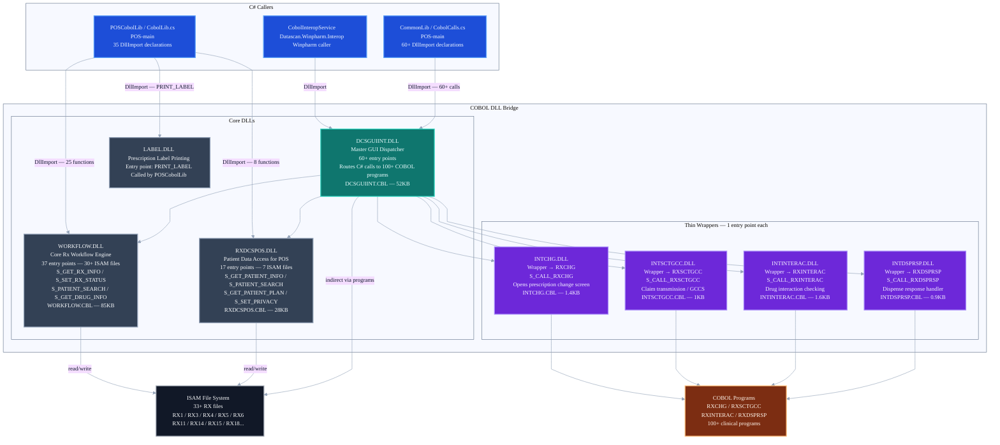

# C3-AS-03 — Component Diagram: COBOL DLL Bridge (AS-IS)

**Container:** COBOL DLL Bridge
**Technology:** RM/COBOL compiled as Windows DLLs — called via P/Invoke (DllImport) from C#
**DLLs:** 8 compiled DLLs — sources in `Winpharm-main/newsourc/Integration/`
**C# Callers:** `POSCobolLib/CobolLib.cs` (35 DllImports), `CommonLib/CobolCalls.cs` (60+ DllImports)

---

## Diagram

---

## DLL Inventory

| DLL | Entry Points | COBOL Source | ISAM Files | C# Caller | Responsibility |
|---|---|---|---|---|---|
| **DCSGUIINT.DLL** | 60+ | `DCSGUIINT.CBL` (52KB) | indirect via programs | `CommonLib/CobolCalls.cs` | Master GUI dispatcher — routes C# calls to 100+ clinical COBOL programs |
| **WORKFLOW.DLL** | 37 | `WORKFLOW.CBL` (85KB) | 30+ direct | `POSCobolLib/CobolLib.cs` (25 functions) | Core Rx workflow engine — prescription state, patient lookup, drug data, delivery, store config |
| **RXDCSPOS.DLL** | 17 | `RXDCSPOS.CBL` (28KB) | 7 direct | `POSCobolLib/CobolLib.cs` (8 functions) | Patient data access for POS — demographics, insurance plans, account, search by name/ID |
| **LABEL.DLL** | 1 | `LABEL.CBL` | — | `POSCobolLib/CobolLib.cs` (PRINT_LABEL) | Prescription label printing |
| **INTCHG.DLL** | 1 | `INTCHG.CBL` (1.4KB) | 0 | via DCSGUIINT | Thin wrapper → `RXCHG` — opens prescription change screen. Isolated for exception handling. |
| **INTSCTGCC.DLL** | 1 | `INTSCTGCC.CBL` (1KB) | 0 | via DCSGUIINT | Thin wrapper → `RXSCTGCC` — claim transmission / GCCS integration |
| **INTINTERAC.DLL** | 1 | `INTINTERAC.CBL` (1.6KB) | 0 | via DCSGUIINT | Thin wrapper → `RXINTERAC` — drug interaction checking. Isolated for complex parameter marshaling. |
| **INTDSPRSP.DLL** | 1 | `INTDSPRSP.CBL` (0.9KB) | 0 | via DCSGUIINT | Thin wrapper → `RXDSPRSP` — dispense response handler |

> **Note:** `WEBAPI.CBL` exists in the Integration folder but is NOT a separately callable DLL from C#. It is an internal COBOL module called directly by `WORKFLOW.CBL`. Zero C# references found.

---

## Why Do the Thin Wrappers Exist as Separate DLLs?

Each thin wrapper exists for a specific reason — they are not redundant:

| DLL | Reason for Isolation |
|---|---|
| **INTCHG.DLL** | Exception handling isolation — wraps `RXCHG` with a dedicated error block so prescription change failures do not propagate to the caller |
| **INTSCTGCC.DLL** | Boundary isolation — `RXSCTGCC` handles GCCS claim transmission differently from general workflow; keeping it separate prevents coupling |
| **INTINTERAC.DLL** | Parameter marshaling — builds a complex `LOC-X300` data bucket string via `STRING` operations before calling `RXINTERAC`; this marshaling logic is isolated here |
| **INTDSPRSP.DLL** | Future extensibility — simple pass-through kept separate to allow decoration (logging, retry logic) without modifying the core dispense response program |

---

## Key Shared Structures

| Struct | Purpose | Used By |
|---|---|---|
| `RxKey` | Site + Rx number (BCD encoded) | WORKFLOW, RXDCSPOS, DCSGUIINT |
| `RxRfKey` | Site + RxRf number (9-digit BCD format) | WORKFLOW, INTCHG, INTSCTGCC |
| `PHS_Info` | Pharmacy station info — StationNumber, SiteId | All DLLs |

---

## Migration Impact

| DLL | Migration Priority | Reason |
|---|---|---|
| **LABEL.DLL** | First | Single entry point — label printing can be replaced with a .NET printing library |
| **INTDSPRSP.DLL** | Early | Single entry point — dispense response is a bounded operation |
| **INTCHG.DLL** | Early | `SETPLAN` already replaced — plan screen no longer needs it |
| **INTSCTGCC.DLL** | Medium | Claim transmission — depends on Insurance domain migration |
| **INTINTERAC.DLL** | Medium | Drug interaction — can be replaced with a dedicated drug interaction service |
| **RXDCSPOS.DLL** | Medium | Patient data — maps directly to `IPatientRepository` pattern already proven in StandAlonePlan |
| **WORKFLOW.DLL** | Late | 37 entry points, 30+ ISAM files — requires full domain migration across Prescription, Patient, Drug, Delivery |
| **DCSGUIINT.DLL** | Last | 60+ entry points dispatching to 100+ COBOL programs — only removable when all downstream programs are migrated |
