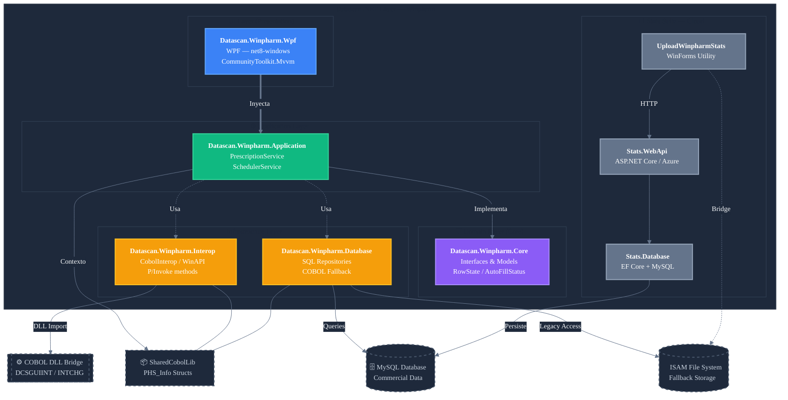

# C3-AS-04 — Component Diagram: Datascan .NET Layer (AS-IS)

**Container:** Datascan .NET Layer
**Technology:** C# — net48 / net8.0 / net10.0
**Projects:** 8 Winpharm projects + 5 POS projects (POS shown as reference — out of migration scope)
**Source:** `Winpharm-main/src/` + `POS-main/`

---

## Diagram

---

## Project Inventory

| Project | Layer | Framework | Responsibility |
|---|---|---|---|
| **Datascan.Winpharm.Core** | Domain | net48 + net8 | All contracts — repository interfaces, service interfaces, domain models, enums. No external dependencies. |
| **Datascan.Winpharm.Application** | Application | net48 + net8 | Business logic orchestration — label printing, store config, scheduler. Depends on Core + Interop. |
| **Datascan.Winpharm.Interop** | Infrastructure | net48 + net8 | Wraps all COBOL DLL calls behind `ICobolInteropService`. 10 P/Invoke methods. Also wraps `user32.dll` for native window management. |
| **Datascan.Winpharm.Database** | Infrastructure | net48 + net8 | Repository implementations — SQL queries with COBOL fallback. Dual-backend per query via `IsTableSQL()` check. |
| **Datascan.Winpharm.Wpf** | UI | net48 + net8-windows | WPF presentation layer. `AutoRefillResultsWindow` is the only migrated screen. `BaseWindow` is the base class for all future WPF screens. |
| **Datascan.Winpharm.Stats.Database** | Infrastructure | net10 | EF Core + Pomelo MySQL for stats data — `Customer`, `StationStats`, `StoreStats` tables. |
| **Datascan.Winpharm.Stats.WebApi** | Service | net10 | ASP.NET Core API receiving stats uploads. Stores files in Azure Blob, queues processing via Azure Queue. |
| **UploadWinpharmStats** | Utility | net48 | WinForms utility that reads stats via COBOL interop and POSTs them to `Stats.WebApi`. |

---

## Key Patterns

| Pattern | Where | Description |
|---|---|---|
| **Clean Architecture** | All Winpharm projects | Domain → Application → Infrastructure → UI. Core has zero dependencies. |
| **Dependency Injection** | All projects | `RegisterXxx()` extension methods per layer — composed in the application root |
| **Dual-backend** | `AutoRefillRepository`, `PrescriptionRepository` | Every query checks `IsTableSQL()` — runs SQL if available, falls back to COBOL file read |
| **P/Invoke bridge** | `CobolInteropService`, `WinAPI` | DllImport to COBOL DLLs and user32.dll — isolated behind interfaces |
| **MVVM** | `Datascan.Winpharm.Wpf` | CommunityToolkit.Mvvm — ObservableProperty, RelayCommand |
| **Global state** | `ApplicationState` | Static holder for `PHS_Info` — pharmacy station context shared across all services |

---

## Migration Notes

| Item | Status | Note |
|---|---|---|
| `AutoRefillResultsWindow` | ✅ Migrated | Only WPF screen in Winpharm — no UseCase layer yet, logic lives in ViewModel |
| `BaseWindow` | ✅ Ready | Base class exists for all future WPF screens |
| `ICobolInteropService` | ✅ Seam exists | Clean interface — replace implementation to remove COBOL dependency |
| `IAutoRefillRepository` | ✅ Seam exists | SQL implementation exists — COBOL fallback still active |
| `IPrescriptionRepository` | ✅ Seam exists | SQL implementation exists — COBOL fallback still active |
| `StoreOptionsService` | ⚠️ No cache | TODO comment in code — reads SharedCobolLib on every call |
| `ApplicationState` | ⚠️ Global state | Static class — needs to be replaced with scoped DI service |
| Stats Suite | ℹ️ Independent | net10 cloud system — separate deployment, not part of COBOL migration path |
