# DllExport — Dependency Map

```mermaid
%%{init: {
  "theme": "base",
  "themeVariables": {
    "fontFamily": "Inter, Segoe UI, sans-serif",
    "fontSize": "13px",
    "background": "#0f172a",
    "primaryColor": "#1e293b",
    "primaryTextColor": "#f8fafc",
    "lineColor": "#64748b",
    "edgeLabelBackground": "#1e293b",
    "tertiaryColor": "#1e293b"
  }
}}%%

flowchart TD

subgraph V174["DllExport 1.7.4 — 10 projects"]
    direction TB
    CM["CoverMyMeds"]
    DR["DCSReportLib"]
    DL["DosisLib"]
    FP["FingerprintAuth"]
    LP["LabelPrint"]
    IL["iLocalBox"]
    MF["MediFriend"]
    SA["DCSSchedAdmin"]
    TC["TransmitClaimLib"]
    MY["CobolMySQLHelper"]
end

subgraph V180["DllExport 1.8.0 — 3 projects"]
    direction TB
    CA["CashAIInterface"]
    RB["RealTimeBenefit"]
    SS["SureScriptsLib"]
end

subgraph V181["DllExport 1.8.1 — 7 projects"]
    direction TB
    DG["DCSGUILib"]
    DF["DCSFunctionLib"]
    DS["DCSScheduler"]
    WS["WorkflowSyncLib"]
    PT["POSTimeclock"]
    SL["ShippingLib"]
    EP["EyeconPhotoRetriever"]
end

subgraph Packages["Package folders on disk"]
    P174["📦 Winpharm-main/src/\npackages/DllExport.1.7.4/\n\nDllExport.bat → Winpharm-main/src/"]
    P180["📦 Winpharm-main/src/Surescripts/\npackages/DllExport.1.8.0/\n\nDllExport.bat → src/Surescripts/"]
    P181["📦 Winpharm-main/src/DCSGUI/\npackages/DllExport.1.8.1/\n\nDllExport.bat → src/DCSGUI/"]
end

CM & DR & DL & FP & LP & IL & MF & SA & TC & MY --> P174
CA & RB & SS --> P180
DG & DF & DS & WS & PT & SL & EP --> P181

classDef v174 fill:#7c3aed,stroke:#a78bfa,color:#fff,stroke-width:2px
classDef v180 fill:#0f766e,stroke:#2dd4bf,color:#fff,stroke-width:2px
classDef v181 fill:#1d4ed8,stroke:#60a5fa,color:#fff,stroke-width:2px
classDef pkg fill:#1e293b,stroke:#475569,color:#94a3b8,stroke-width:2px,stroke-dasharray:5 5

class CM,DR,DL,FP,LP,IL,MF,SA,TC,MY v174
class CA,RB,SS v180
class DG,DF,DS,WS,PT,SL,EP v181
class P174,P180,P181 pkg
```

---

| Proyecto | Versión DllExport |
|---|---|
| CoverMyMeds | 1.7.4 |
| DCSReportLib | 1.7.4 |
| DosisLib | 1.7.4 |
| FingerprintAuth | 1.7.4 |
| LabelPrint | 1.7.4 |
| iLocalBox | 1.7.4 |
| MediFriend | 1.7.4 |
| DCSSchedAdmin | 1.7.4 |
| TransmitClaimLib | 1.7.4 |
| CobolMySQLHelper | 1.7.4 |
| CashAIInterface | 1.8.0 |
| RealTimeBenefit | 1.8.0 |
| SureScriptsLib | 1.8.0 |
| DCSGUILib | 1.8.1 |
| DCSFunctionLib | 1.8.1 |
| DCSScheduler | 1.8.1 |
| WorkflowSyncLib | 1.8.1 |
| POSTimeclock | 1.8.1 |
| ShippingLib | 1.8.1 |
| EyeconPhotoRetriever | 1.8.1 |

---

## Why are there different versions?

**Release timeline** (from GitHub):

| Version | Release date | Key addition |
|---|---|---|
| **1.8.0** | Feb 25, 2018 | Introduced `DllExportDir` — packages folder no longer tied to `$(SolutionDir)` |
| **1.8.1** | Jun 8, 2018 | Bug fixes — ILMerge, PDB support, `[Ref]` without strict merging |
| **1.7.4** | Jan 2, 2019 | Maintenance patch on 1.7 branch — fixed MSBuild 16.8+ compatibility, FIPS support |

> Note: 1.7.4 was released **after** 1.8.1. The 1.7 and 1.8 branches were maintained in parallel.

**The real reason for the split is `DllExportDir`:**

| Group | Path used | Why |
|---|---|---|
| 1.7.4 — 10 projects | `$(SolutionDir)` | Built from the main `Winpharm-main/src/` solution. DllExport.bat lives at the solution root. No need for a custom path. |
| 1.8.0 — Surescripts | `$(MSBuildProjectDirectory)\..\` | Surescripts is a separate subsystem with its own packages folder. `DllExportDir` (added in 1.8.0) makes this possible. |
| 1.8.1 — DCSGUI | `$(MSBuildProjectDirectory)\..\` | Same reason — DCSGUI is built independently. Upgraded to 1.8.1 for the bug fixes in that release. |

The 10 projects on 1.7.4 never needed `DllExportDir` because they all share the same solution root. They received the 1.7.4 maintenance patch when it fixed MSBuild 16.8+ compatibility.

---

## Can all projects be updated to a single version?

Before upgrading the 10 projects currently on 1.7.4:
- Verify no reliance on behavior that changed between 1.7.4 and 1.8.1
- Add `DllExportDir` pointing to the packages folder (the 1.7.4 projects currently rely on `$(SolutionDir)` instead)
- Once unified, `DllExportNoRestore=true` can be applied across all 20 projects to eliminate the double-build
