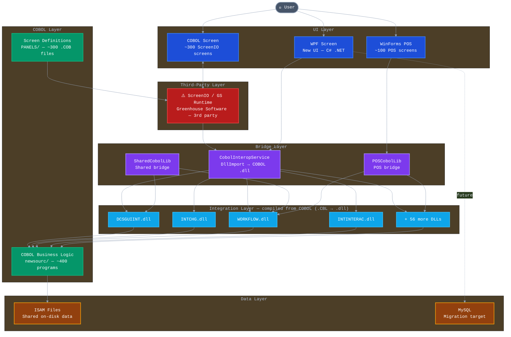

# Layered Architecture Diagram — Winpharm / POS System

This diagram represents the static structural organization of the Winpharm and POS systems, divided into horizontal layers. Each layer has a defined responsibility and communicates only with the layers directly adjacent to it. It is intended to help both technical stakeholders understand where each technology lives, how the legacy COBOL stack connects to the modern C# .NET interfaces, and which third-party dependency (ScreenIO / GS Runtime) sits between the user-facing UI and the underlying business logic.

---

---

## Layer and component reference

| Level | Layer | Component | Description |
|-------|-------|-----------|-------------|
| 1 | **UI Layer** | COBOL Screen | The legacy graphical interface. Each screen is defined by a `.COB` file in `PANELS/`. Rendered entirely by ScreenIO — no standard Win32 controls. |
| 1 | **UI Layer** | WPF Screen | The new modern interface built in C# .NET using WPF and Clean Architecture. This is the migration target for all COBOL screens. |
| 1 | **UI Layer** | WinForms POS | The Point-of-Sale interface. ~100 forms built in Windows Forms (.NET). Partially being migrated to WPF. |
| 2 | **Third-Party Layer** | ScreenIO / GS Runtime | Proprietary UI engine by Greenhouse Software. Acts as the graphical runtime for COBOL screens — renders windows, captures input, and fires numeric event IDs back to COBOL. Without it, COBOL has no GUI. |
| 3 | **Bridge Layer** | CobolInteropService | C# service that calls compiled COBOL DLLs via `DllImport`. It is the primary entry point from the .NET side into COBOL functionality. |
| 3 | **Bridge Layer** | SharedCobolLib | Shared interop library consumed by both Winpharm and POS. Exposes common COBOL functions to .NET. |
| 3 | **Bridge Layer** | POSCobolLib | POS-specific interop bridge. Exposes COBOL functions required by the POS WinForms layer. |
| 4 | **Integration Layer** | DCSGUIINT.dll | Handles label printing, claim transmission, and display response screens. Compiled from `DCSGUIINT.CBL`. |
| 4 | **Integration Layer** | INTCHG.dll | Opens the Rx Edit screen (Fill Prescription flow). Compiled from `INTCHG.CBL`. |
| 4 | **Integration Layer** | WORKFLOW.dll | Manages workflow state across both Winpharm and POS. Shared dependency between both systems. |
| 4 | **Integration Layer** | INTINTERAC.dll | Performs drug interaction checks. Compiled from `INTINTERAC.CBL`. |
| 4 | **Integration Layer** | +56 more DLLs | Additional compiled COBOL modules in `Integration/`. Source code available as `.CBL` files — not black boxes. |
| 5 | **COBOL Layer** | COBOL Business Logic | Core business rules of the pharmacy system. ~400 programs in `newsourc/` covering prescriptions, insurance plans, patients, drugs, claims, workflow, and more. |
| 5 | **COBOL Layer** | Screen Definitions | ScreenIO panel definitions in `PANELS/`. Each `.COB` file defines the layout, fields, and event IDs for one screen. This inventory equals the full migration backlog. |
| 6 | **Data Layer** | ISAM Files | Legacy indexed sequential access files stored on disk. Shared between Winpharm and POS. No SQL engine — direct file I/O from COBOL. |
| 6 | **Data Layer** | MySQL | The target database for the migrated system. New WPF screens write directly to MySQL, bypassing COBOL entirely. |
