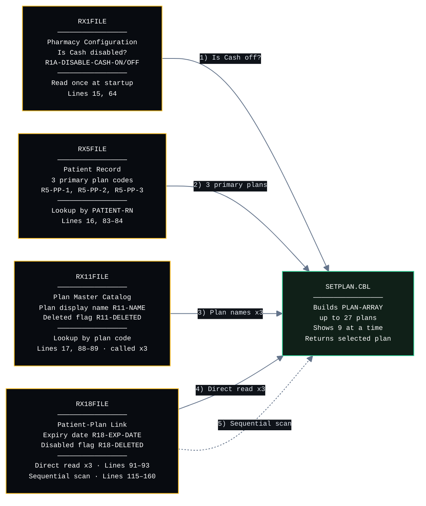
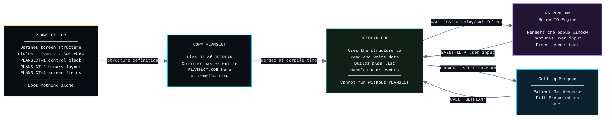
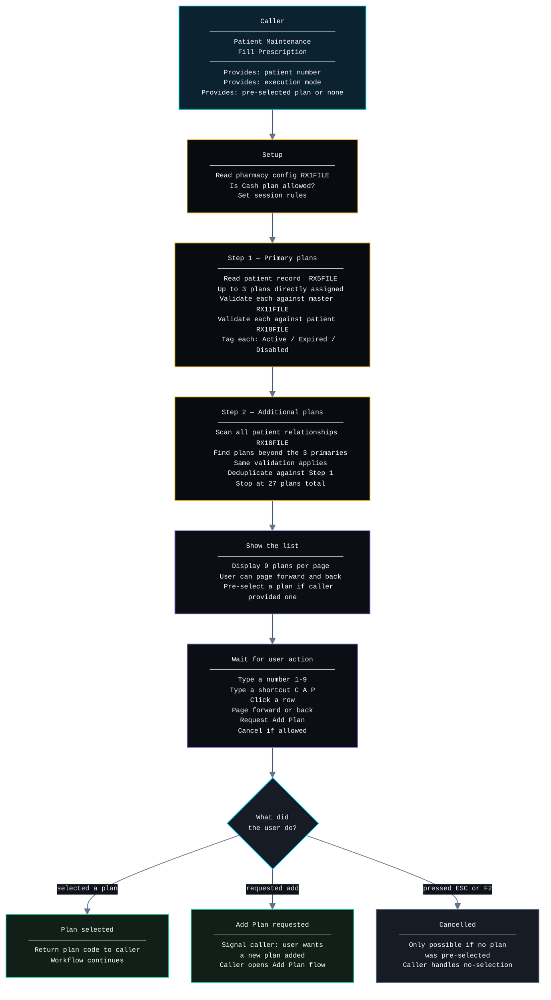
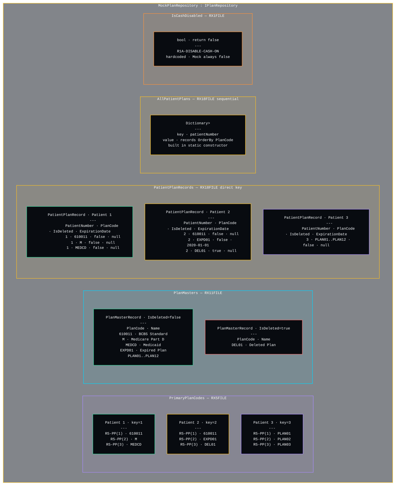
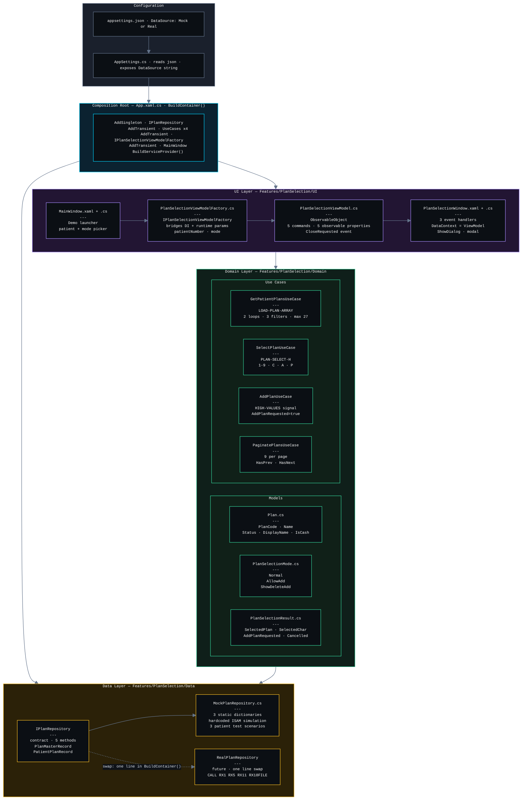
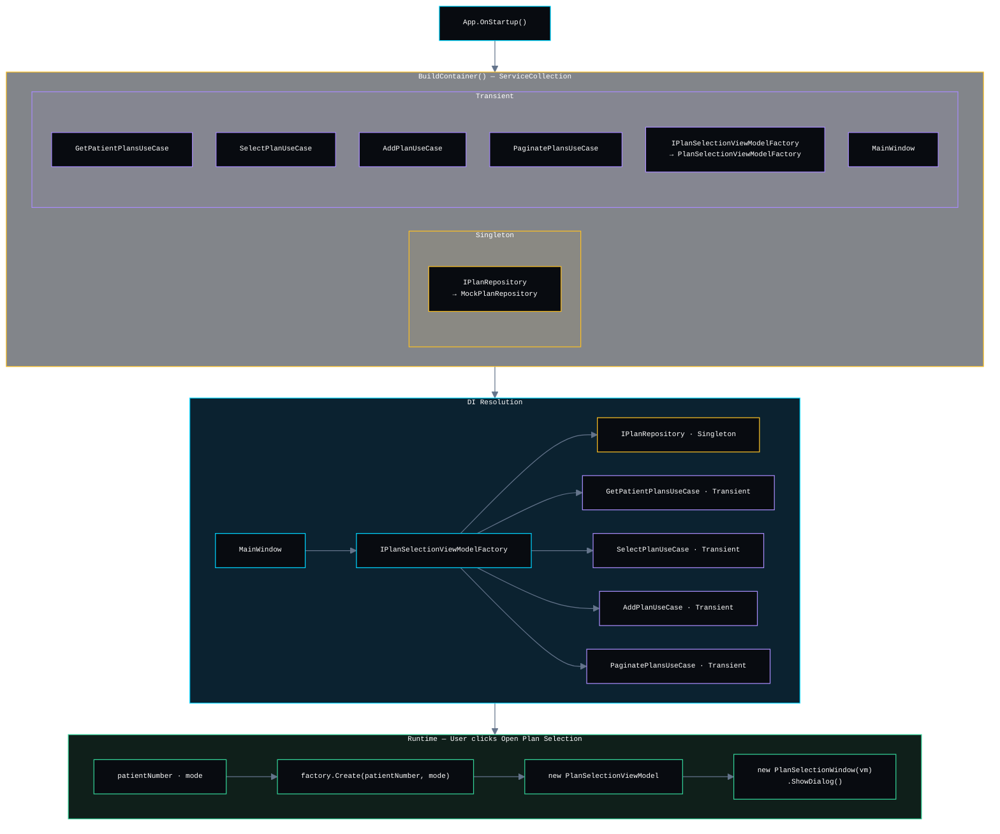
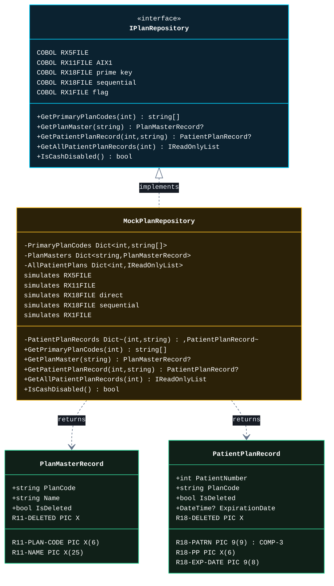
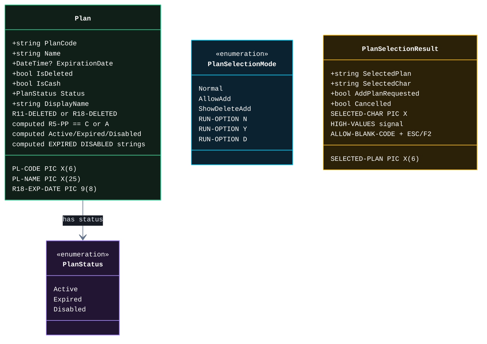
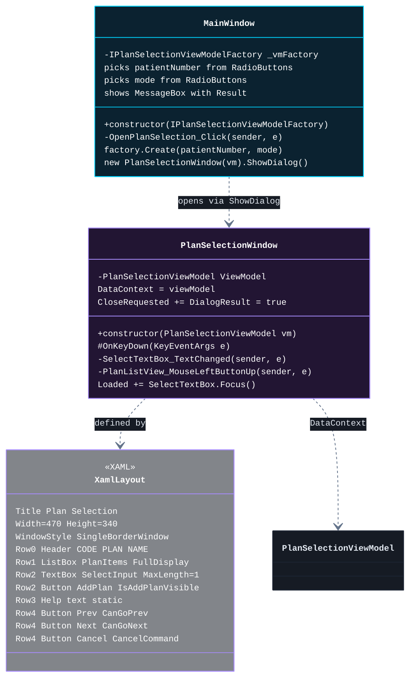

```mermaid
%%{init:{'theme':'base','themeVariables':{'primaryColor':'#161b24','primaryTextColor':'#e2e8f0','primaryBorderColor':'#1c2433','lineColor':'#64748b','edgeLabelBackground':'#0f1319','fontFamily':'JetBrains Mono, monospace','fontSize':'11px','background':'#080b10'}}}%%
classDiagram

    class GetPatientPlansUseCase {
        -IPlanRepository _repository
        -const int MaxPlans = 27
        +Execute(int patientNumber, PlanSelectionMode mode) IReadOnlyList~Plan~
        -BuildPlan(PlanMasterRecord, PatientPlanRecord?, DateTime) Plan
    }

    class SelectPlanUseCase {
        +Execute(string input, IReadOnlyList~Plan~ page, bool cashDisabled) PlanSelectionResult
    }

    class AddPlanUseCase {
        +Execute(PlanSelectionMode mode) PlanSelectionResult
    }

    class PaginatePlansUseCase {
        -const int PageSize = 9
        +Execute(IReadOnlyList~Plan~ allPlans, int pageStart) PageResult
    }

    class IPlanRepository {
        <<interface>>
        +IsCashDisabled() bool
        +GetPrimaryPlanCodes(int) string[]
        +GetPlanMaster(string) PlanMasterRecord?
        +GetPatientPlanRecord(int, string) PatientPlanRecord?
        +GetAllPatientPlanRecords(int) IReadOnlyList~PatientPlanRecord~
    }

    class Plan {
        +string PlanCode
        +string Name
        +PlanStatus Status
        +string DisplayName
        +bool IsCash
    }

    class PlanSelectionResult {
        +string SelectedPlan
        +string SelectedChar
        +bool AddPlanRequested
        +bool Cancelled
    }

    class PageResult {
        +IReadOnlyList~Plan~ Items
        +bool HasPrev
        +bool HasNext
    }

    GetPatientPlansUseCase --> IPlanRepository : uses
    GetPatientPlansUseCase ..> Plan : creates
    SelectPlanUseCase ..> Plan : reads
    SelectPlanUseCase ..> PlanSelectionResult : returns
    AddPlanUseCase ..> PlanSelectionResult : returns
    PaginatePlansUseCase ..> Plan : paginates
    PaginatePlansUseCase ..> PageResult : returns

    style GetPatientPlansUseCase fill:#0f1f1a,stroke:#34d399,color:#ffffff
    style SelectPlanUseCase fill:#0f1f1a,stroke:#34d399,color:#ffffff
    style AddPlanUseCase fill:#0f1f1a,stroke:#34d399,color:#ffffff
    style PaginatePlansUseCase fill:#0f1f1a,stroke:#34d399,color:#ffffff

    style IPlanRepository fill:#0b2230,stroke:#00d4ff,color:#ffffff

    style Plan fill:#102018,stroke:#34d399,color:#ffffff
    style PlanSelectionResult fill:#2b2108,stroke:#fbbf24,color:#ffffff
    style PageResult fill:#2b2108,stroke:#fbbf24,color:#ffffff
```

# StandAlonePlan — Functional Requirements

## Overview

StandAlonePlan is a WPF dialog that asks the pharmacist which insurance plan to use for a patient.
It is called from Fill Prescription and Patient Maintenance when a plan selection is needed.
The patient may have up to 27 plans — the dialog loads, filters, and paginates them so the pharmacist
can select one, request a new plan to be added, or cancel.

This project is a COBOL-to-C# migration of `SETPLAN.CBL` from the Winpharm system,
following Clean Architecture with MVVM pattern and Dependency Injection.

## What Are We Building?

A standalone WPF window that lets pharmacy staff pick an insurance plan for a patient.
This screen was originally written in COBOL.Rebuilding it in .NET 4.8 / WPF
so it can run and be tested without any COBOL dependencies.

---

## Requirements

| #  | Requirement | COBOL Source | C# Implementation | Layer | Type | Status |
|----|-------------|--------------|-------------------|-------|------|--------|
| 01 | The dialog is opened by Fill Prescription or Patient Maintenance passing patient number, operation mode, and current selected plan | `SETPLAN.CBL` · `CALL 'SETPLAN'` · LINKAGE SECTION: `PATIENT-RN` · `RUN-OPTION` · `SELECTED-PLAN` | `MainWindow.xaml.cs` · `OpenPlanSelection_Click()` · `factory.Create(patientNumber, mode)` · `ShowDialog()` | UI | Functional | Implemented |
| 02 | If the caller puts HIGH-VALUES in SELECTED-PLAN, cancel is allowed via ESC or F2 | `SETPLAN.CBL` · `ALLOW-BLANK-CODE` · `HIGH-VALUES` check on entry | `PlanSelectionViewModel.cs` · `_allowBlankCode` field · set in constructor when `currentSelectedPlan == null` | ViewModel | Functional | Implemented |
| 03 | Check whether Cash plan is disabled for this pharmacy before loading plans | `SETPLAN.CBL` · `CALL RX1FILE` · flag `R1A-DISABLE-CASH-ON` | `MockPlanRepository.cs` · `IsCashDisabled()` · `IPlanRepository` contract | Data | Functional | Mock |
| 04 | Load up to 3 primary plans assigned to the patient | `SETPLAN.CBL` · `CALL RX5FILE` · `R5-PP(1)` `R5-PP(2)` `R5-PP(3)` | `MockPlanRepository.cs` · `GetPrimaryPlanCodes(int)` · `IPlanRepository` contract | Data | Functional | Mock |
| 05 | Validate each plan exists in the master catalog | `SETPLAN.CBL` · `CALL RX11FILE` · alternate index `AIX1` · `STATUS-NOT-FOUND` check | `MockPlanRepository.cs` · `GetPlanMaster(string)` · returns `PlanMasterRecord?` · null = not found | Data | Functional | Mock |
| 06 | Validate each plan is active for the specific patient checking deleted flag and expiration date | `SETPLAN.CBL` · `CALL RX18FILE` · prime key `R18-PATRN + R18-PP` · `R18-DELETED` · `R18-EXP-DATE` | `MockPlanRepository.cs` · `GetPatientPlanRecord(int, string)` · returns `PatientPlanRecord?` | Data | Functional | Mock |
| 07 | Scan all additional plans beyond the 3 primary ones using sequential file access | `SETPLAN.CBL` · `START RX18FILE` · `READ-NEXT` loop until `R18-PATRN` changes | `MockPlanRepository.cs` · `GetAllPatientPlanRecords(int)` · pre-sorted index built in static constructor | Data | Functional | Mock |
| 08 | Merge master catalog data and patient-plan relationship into a single plan entity | `SETPLAN.CBL` · `LOAD-PLAN-ARRAY` · merge `R11FILE` + `R18FILE` fields into `PL-CODE` `PL-NAME` | `GetPatientPlansUseCase.cs` · `BuildPlan()` · merges `PlanMasterRecord` + `PatientPlanRecord` → `Plan` | Domain | Technical | Implemented |
| 09 | Mark plans as ACTIVE, EXPIRED, or DISABLED based on deleted flag and expiration date | `SETPLAN.CBL` · `R11-DELETED` · `R18-DELETED` · `R18-EXP-DATE < SYS-DATE` · strings `**EXPIRED**` `**DISABLED**` | `Plan.cs` · computed property `Status` → `PlanStatus` enum · computed property `DisplayName` | Domain | Functional | Implemented |
| 10 | In Normal mode show only active plans with no Add Plan button | `SETPLAN.CBL` · `88 MODE-NORMAL` · `RUN-OPTION = 'N'` | `PlanSelectionMode.cs` · `PlanSelectionMode.Normal` · `GetPatientPlansUseCase.Execute()` filters deleted and expired | Domain | Functional | Implemented |
| 11 | In AllowAdd mode show only active plans and display the Add Plan button | `SETPLAN.CBL` · `88 ALLOW-ADD` · `RUN-OPTION = 'Y'` | `PlanSelectionMode.cs` · `PlanSelectionMode.AllowAdd` · `IsAddPlanVisible = true` in `PlanSelectionViewModel.cs` | Domain | Functional | Implemented |
| 12 | In ShowDeleteAdd mode show all plans including expired and deleted, display Add Plan button | `SETPLAN.CBL` · `88 SHOW-DELETE-ADD` · `RUN-OPTION = 'D'` | `PlanSelectionMode.cs` · `PlanSelectionMode.ShowDeleteAdd` · `showDelAdd = true` in `GetPatientPlansUseCase.Execute()` | Domain | Functional | Implemented |
| 13 | Limit the total plan list to a maximum of 27 plans | `SETPLAN.CBL` · `PLAN-ARRAY-MAX VALUE 27` | `GetPatientPlansUseCase.cs` · `MaxPlans = 27` constant | Domain | Functional | Implemented |
| 14 | Display a maximum of 9 plans per page | `SETPLAN.CBL` · `PLAN-1` to `PLAN-9` · 9 panel display fields | `PaginatePlansUseCase.cs` · `PageSize = 9` constant · `Execute()` returns `Skip(start).Take(9)` | Domain | Functional | Implemented |
| 15 | Navigate to previous page of plans | `SETPLAN.CBL` · `PLANSLCT-SEARCH-PREV` · event-id `4` · `SET PLAX DOWN BY MAX-LINE` | `PlanSelectionViewModel.cs` · `PrevCommand` · `ExecutePrev()` · `_pageStart -= PageSize` · `RefreshPage()` | ViewModel | Functional | Implemented |
| 16 | Navigate to next page of plans | `SETPLAN.CBL` · `PLANSLCT-SEARCH-NEXT` · event-id `5` · `SET PLAX UP BY MAX-LINE` | `PlanSelectionViewModel.cs` · `NextCommand` · `ExecuteNext()` · `_pageStart += PageSize` · `RefreshPage()` | ViewModel | Functional | Implemented |
| 17 | Select a plan by typing a number 1 through 9 — auto-submit on first character | `SETPLAN.CBL` · `PLAN-SELECT-H` · event-id `1010` · field-full hot-return | `PlanSelectionWindow.xaml.cs` · `SelectTextBox_TextChanged()` · fires `SelectCommand` · `SelectPlanUseCase.Execute()` | UI | Functional | Implemented |
| 18 | Select a plan by clicking a row in the list | `SETPLAN.CBL` · `PLAN-1-S` to `PLAN-9-S` · event-ids `6001-6009` | `PlanSelectionWindow.xaml.cs` · `PlanListView_MouseLeftButtonUp()` · `PlanSelectionViewModel.SelectByRow()` | UI | Functional | Implemented |
| 19 | Select Cash plan by typing C or A | `SETPLAN.CBL` · `PLAN-SELECT = 'C'` or `'A'` · `WHEN PLAN-SELECT-H` | `SelectPlanUseCase.cs` · `Execute()` · key == "C" or "A" branch · returns `SelectedPlan = key` | Domain | Functional | Implemented |
| 20 | Select Coupon by typing P | `SETPLAN.CBL` · `PLAN-SELECT = 'P'` · `MOVE 'COUPON' TO SELECTED-PLAN` | `SelectPlanUseCase.cs` · `Execute()` · key == "P" branch · returns `SelectedPlan = "COUPON"` | Domain | Functional | Implemented |
| 21 | Request adding a new plan via Add Plan button | `SETPLAN.CBL` · `WHEN PLANSLCT-ADD-PLAN` · `MOVE HIGH-VALUES TO SELECTED-PLAN` | `AddPlanUseCase.cs` · `Execute()` · returns `AddPlanRequested = true` · `PlanSelectionViewModel.AddPlanCommand` | Domain | Functional | Implemented |
| 22 | Cancel the dialog via ESC or F2 only when cancel is allowed | `SETPLAN.CBL` · `PLANSLCT-ESC` event-id `1` · `PLANSLCT-F2` event-id `2` · `ALLOW-BLANK-CODE = 'Y'` check | `PlanSelectionWindow.xaml.cs` · `OnKeyDown()` · `CancelCommand.CanExecute` checks `_allowBlankCode` | UI | Functional | Implemented |
| 23 | Return selected plan code and selected character to the caller | `SETPLAN.CBL` · LINKAGE SECTION · `SELECTED-PLAN PIC X(6)` · `SELECTED-CHAR PIC X` | `PlanSelectionResult.cs` · `SelectedPlan` · `SelectedChar` · read by caller in `MainWindow.OpenPlanSelection_Click()` | Domain | Functional | Implemented |
| 24 | Display plan rows in monospaced format matching COBOL 35-char field layout | `SETPLAN.CBL` · `PLAN-n PIC X(35)` · REDEFINES: number(3) + code(6) + filler(1) + name(25) | `PlanSelectionViewModel.cs` · `PlanPageItem.FullDisplay` · format `{Number}. {PlanCode,-6} {nameDisplay}` · Courier New | UI | Technical | Implemented |

---

## Layer Legend

| Layer | Description |
|-------|-------------|
| UI | `MainWindow` · `PlanSelectionWindow` · XAML · Code-Behind |
| ViewModel | `PlanSelectionViewModel` · Commands · Observable State |
| Domain | Use Cases · Models · Business Rules |
| Data | `IPlanRepository` · `MockPlanRepository` · ISAM file abstraction |

## Status Legend

| Status | Description |
|--------|-------------|
| Implemented | Fully working in current codebase |
| Mock | Implemented with hardcoded test data · requires `RealPlanRepository` for production |
| Pending | Not yet implemented |

## Type Legend

| Type | Description |
|------|-------------|
| Functional | What the system does from the user or caller perspective |
| Technical | How the system is built · architecture · patterns · constraints |

## Diagrams

<strong>Cobol Files Relationship</strong>

<strong>Cobol Components</strong>

<strong>Cobol logic workflow</strong>

<strong>Mock Data</strong>

<strong>Clean Architecture Overview</strong>

<strong>Dependency Injection Container</strong>

<strong>MVVM Structure</strong>

[View](Features/PlanSelection/Documentation/v1/diagrams/mvvm.svg)

<strong>Repository Class Diagram</strong>

<strong>Domain Core Class Diagram</strong>

<strong>Use Cases Class Diagram</strong>

<strong>UI Layer Class Diagram</strong>

## Test Coverage

### Summary

| Test Class | Layer | Tests | What It Covers |
|------------|-------|------:|----------------|
| `GetPatientPlansUseCaseTests` | Domain | 23 | Primary plan loading, additional plan scan, cash disable, deleted/expired filtering per mode, max-27 cap |
| `SelectPlanUseCaseTests` | Domain | 16 | Numeric row selection, cash direct input (C/A/P), invalid input, cash-disabled guard, lowercase normalization |
| `AddPlanUseCaseTests` | Domain | 3 | Add Plan signal (HIGH-VALUES) per mode — Normal blocks it, AllowAdd and ShowDeleteAdd allow it |
| `PaginatePlansUseCaseTests` | Domain | 10 | Page slicing (PageSize=9), Prev/Next flags, negative start clamping, exact plan codes per page |
| `MockPlanRepositoryTests` | Data | 12 | R5FILE primary codes, R11FILE master lookup, R18FILE sequential scan, expiration/deletion flags |
| `PlanSelectionViewModelTests` | ViewModel | 20 | Constructor state, all 5 commands (Select/SelectByRow/Next/Prev/AddPlan/Cancel), pagination, CloseRequested |
| `PlanSelectionViewModelFactoryTests` | ViewModel | 4 | Factory wires patientNumber + mode correctly, PlanItems populated on creation |
| **Total** | | **88** | |

---

### GetPatientPlansUseCaseTests — 23 tests

| Test | What It Verifies |
|------|-----------------|
| `Execute_ThreeActivePrimaryPlans_ReturnsThreePlans` | 3 active primary codes → exactly 3 plans returned |
| `Execute_ActivePrimaryPlan_DisplayNameHasLeadingSpace` | Active plan DisplayName starts with a leading space (mirrors COBOL STRING " " R11-NAME) |
| `Execute_PrimaryCashPlan_CashDisabled_Excluded` | Cash plan code "C" excluded when R1A-DISABLE-CASH-ON is true |
| `Execute_PrimaryCashPlan_CashEnabled_Included` | Cash plan "C" included when Cash is enabled |
| `Execute_PrimaryPlanMasterNotFound_Excluded` | Plan skipped when R11FILE returns STATUS-NOT-FOUND (null) |
| `Execute_PrimaryMasterDeleted_NormalMode_Excluded` | R11-DELETED=true hidden in Normal mode |
| `Execute_PrimaryMasterDeleted_ShowDeleteAdd_IncludedAsDisabled` | R11-DELETED=true shown as **DISABLED** in ShowDeleteAdd mode |
| `Execute_PrimaryR18NotFound_NormalMode_Excluded` | No R18FILE record for a primary plan → plan excluded in Normal mode |
| `Execute_PrimaryR18Deleted_NormalMode_Excluded` | R18-DELETED=true on patient-plan record excluded in Normal mode |
| `Execute_PrimaryR18Deleted_ShowDeleteAdd_IncludedAsDisabled` | R18-DELETED=true shown as **DISABLED** in ShowDeleteAdd mode |
| `Execute_PrimaryR18Expired_NormalMode_Excluded` | Expired plan (R18-EXP-DATE in the past) hidden in Normal mode |
| `Execute_PrimaryR18Expired_ShowDeleteAdd_IncludedAsExpired` | Expired plan shown as **EXPIRED** in ShowDeleteAdd mode |
| `Execute_AdditionalActivePlan_NotPrimary_Included` | Active plan found only in R18FILE sequential scan is added to the list |
| `Execute_AdditionalDuplicateOfPrimary_Excluded` | Plan already in primary list not duplicated from sequential scan |
| `Execute_AdditionalCash_CashDisabled_Excluded` | Cash plan in sequential scan excluded when Cash is disabled |
| `Execute_AdditionalR18Deleted_NormalMode_Excluded` | R18-DELETED=true additional plan excluded in Normal mode |
| `Execute_AdditionalR18Deleted_ShowDeleteAdd_IncludedAsDisabled` | R18-DELETED=true additional plan shown as **DISABLED** in ShowDeleteAdd |
| `Execute_AdditionalR18Expired_NormalMode_Excluded` | Expired additional plan hidden in Normal mode |
| `Execute_AdditionalR18Expired_ShowDeleteAdd_IncludedAsExpired` | Expired additional plan shown as **EXPIRED** in ShowDeleteAdd |
| `Execute_AdditionalR11Deleted_ShowDeleteAdd_IncludedAsDisabled` | R11-DELETED=true on additional plan master shown as **DISABLED** in ShowDeleteAdd |
| `Execute_AdditionalR11Deleted_NormalMode_Excluded` | R11-DELETED=true on additional plan master excluded in Normal mode |
| `Execute_NoPlansAnywhere_ReturnsEmpty` | No primary codes and no R18FILE records → empty result, no exception |
| `Execute_MoreThan27Plans_CappedAt27` | 31 available plans (3 primary + 28 additional) capped at PLAN-ARRAY-MAX = 27 |

---

### SelectPlanUseCaseTests — 16 tests

| Test | What It Verifies |
|------|-----------------|
| `Execute_Input1_ReturnsFirstPlan` | "1" selects row index 0 — SelectedPlan = first plan code, SelectedChar = "1" |
| `Execute_Input3_ReturnsThirdPlan` | "3" selects row index 2 |
| `Execute_Input9_With9Plans_ReturnsNinthPlan` | "9" selects the last row on a full 9-plan page |
| `Execute_Input0_Cancelled` | "0" is out of range (rows are 1–9) → Cancelled |
| `Execute_Input10_Cancelled` | Two-digit "10" exceeds valid range → Cancelled |
| `Execute_Input5_OnlyThreePlans_Cancelled` | "5" with only 3 plans on page → Cancelled (index out of range) |
| `Execute_NumericIndex_PlanIsCash_CashDisabled_Cancelled` | Numeric row that holds a Cash plan blocked when Cash is disabled |
| `Execute_NumericIndex_PlanIsCash_CashEnabled_ReturnsC` | Numeric row holding a Cash plan returns "C" when Cash is enabled |
| `Execute_InputC_CashEnabled_ReturnsCash` | Direct "C" key selects Cash — SelectedPlan = "C", SelectedChar = "C" |
| `Execute_InputA_CashEnabled_ReturnsCash` | Direct "A" key is the alternate Cash key — SelectedPlan = "A" |
| `Execute_InputC_CashDisabled_Cancelled` | Direct "C" key blocked when Cash is disabled |
| `Execute_InputP_ReturnsCoupon` | "P" sets SelectedPlan = "COUPON", SelectedChar = "P" |
| `Execute_EmptyInput_Cancelled` | Empty string input → Cancelled |
| `Execute_WhitespaceInput_Cancelled` | Whitespace-only input treated as empty → Cancelled |
| `Execute_InvalidTextInput_Cancelled` | Unrecognized character "X" → Cancelled |
| `Execute_LowercaseInput_TreatedAsUppercase` | Lowercase "c" normalized to "C" — Cash is selected |

---

### AddPlanUseCaseTests — 3 tests

| Test | What It Verifies |
|------|-----------------|
| `Execute_ModeNormal_ReturnsCancelled` | Normal mode has no Add Plan button — use case returns Cancelled as a defensive guard |
| `Execute_ModeAllowAdd_ReturnsAddPlanRequested` | AllowAdd mode ("Y") — returns AddPlanRequested = true (HIGH-VALUES signal) |
| `Execute_ModeShowDeleteAdd_ReturnsAddPlanRequested` | ShowDeleteAdd mode ("D") — same HIGH-VALUES signal as AllowAdd |

---

### PaginatePlansUseCaseTests — 10 tests

| Test | What It Verifies |
|------|-----------------|
| `Execute_EmptyList_ReturnsEmptyPageNoPrevNoNext` | Zero plans → empty page, HasPrev = false, HasNext = false |
| `Execute_FivePlans_PageStart0_ReturnsFiveItems` | 5 plans fit in one page — all 5 returned, no navigation needed |
| `Execute_ExactlyNinePlans_PageStart0_ReturnsNineNoPrevNoNext` | Exactly 9 plans (PageSize) fills one page — no Prev, no Next |
| `Execute_TenPlans_PageStart0_ReturnsNineAndHasNext` | 10 plans on page 0 — 9 returned, HasNext = true |
| `Execute_TenPlans_PageStart9_ReturnsOneAndHasPrev` | 10 plans on page 9 — 1 remaining, HasPrev = true, HasNext = false |
| `Execute_TwentySevenPlans_PageStart9_HasBothPrevAndNext` | 27 plans on middle page — HasPrev = true, HasNext = true |
| `Execute_TwentySevenPlans_PageStart18_LastPageHasNineAndHasPrev` | Last page of 27 — 9 plans, HasPrev = true, HasNext = false |
| `Execute_NegativePageStart_ClampedToZero` | Negative start clamped to 0 — no exception, reads from beginning |
| `Execute_CorrectPlanCodesOnFirstPage` | First page of 12 — P01 at index 0, P09 at index 8 |
| `Execute_CorrectPlanCodesOnSecondPage` | Second page of 12 (start=9) — P10 at index 0, P12 at index 2 |

---

### MockPlanRepositoryTests — 12 tests

| Test | What It Verifies |
|------|-----------------|
| `GetPrimaryPlanCodes_Patient1_ReturnsThreeActiveCodes` | Patient 1 returns exactly 3 active codes: 610011, M, MEDCD |
| `GetPrimaryPlanCodes_Patient2_ContainsExpiredAndDeleted` | Patient 2 includes EXPD01 (expired) and DEL01 (deleted) |
| `GetPrimaryPlanCodes_Patient3_HasThreePrimaries` | Patient 3 has 3 primary codes (pagination scenario) |
| `GetPrimaryPlanCodes_UnknownPatient_ReturnsEmpty` | Unknown patient returns empty array without exception |
| `GetPlanMaster_ExistingCode_ReturnsMaster` | Known code "610011" returns master record with correct name and IsDeleted = false |
| `GetPlanMaster_DeletedCode_ReturnsDeletedRecord` | "DEL01" returns record with IsDeleted = true |
| `GetPlanMaster_UnknownCode_ReturnsNull` | Unknown code "GHOST" returns null (STATUS-NOT-FOUND equivalent) |
| `GetAllPatientPlanRecords_Patient3_Returns12Records` | Patient 3 sequential scan returns all 12 plan records |
| `GetAllPatientPlanRecords_Patient3_OrderedByPlanCode` | Records are ordered by PlanCode (mirrors ISAM sequential read order) |
| `GetAllPatientPlanRecords_Patient2_ContainsExpiredRecord` | Patient 2 includes EXPD01 with a non-null ExpirationDate |
| `GetAllPatientPlanRecords_UnknownPatient_ReturnsEmpty` | Unknown patient returns empty list without exception |
| `IsCashDisabled_ReturnsFalse` | Mock always returns false — Cash is enabled in all demo scenarios |

---

### PlanSelectionViewModelTests — 20 tests

| Test | What It Verifies |
|------|-----------------|
| `Constructor_Patient1_LoadsThreePlanItems` | Patient 1 has 3 active plans — PlanItems populated with exactly 3 rows |
| `Constructor_Patient3_FirstPageHasNineItems` | Patient 3 has 12 plans — first page shows exactly 9 (PageSize limit) |
| `Constructor_ModeNormal_AddPlanNotVisible` | Normal mode ("N") — IsAddPlanVisible = false |
| `Constructor_ModeAllowAdd_AddPlanVisible` | AllowAdd mode ("Y") — IsAddPlanVisible = true |
| `Constructor_ModeShowDeleteAdd_AddPlanVisible` | ShowDeleteAdd mode ("D") — IsAddPlanVisible = true |
| `Constructor_Patient1_PrevCanExecuteIsFalse` | Patient 1 fits in one page — PrevCommand.CanExecute = false on open |
| `Constructor_Patient3_NextCanExecuteIsTrue` | Patient 3 has 12 plans (2 pages) — NextCommand.CanExecute = true on open |
| `Constructor_Patient1_CanGoNextIsFalse` | Patient 1 fits in one page — CanGoNext observable = false |
| `SelectCommand_ValidInput_SetsResultAndFiresClose` | Input "1" — Result set with plan code, CloseRequested fires |
| `SelectCommand_ValidInput_SelectedPlanMatchesFirstItem` | Input "1" — SelectedPlan matches PlanCode of first PlanItem |
| `SelectCommand_InvalidInput_ResultIsNullAndInputCleared` | Input "X" — CloseRequested does not fire, Result stays null, SelectInput cleared |
| `SelectCommand_InputP_ResultIsCoupon` | Input "P" — SelectedPlan = "COUPON" |
| `SelectByRow_ValidPlan_SetsResultAndFiresClose` | Clicking a row — Result uses the row's PlanCode, SelectedChar = its Number |
| `NextCommand_Patient3_LoadsSecondPageWithThreeItems` | After Next on Patient 3 — second page shows 3 items (12 - 9 = 3) |
| `NextCommand_Patient3_EnablesPrevDisablesNext` | After Next — CanGoPrev = true, CanGoNext = false |
| `PrevCommand_AfterNext_RestoresFirstPageNineItems` | After Next then Prev — first page restored with 9 items, CanGoPrev = false |
| `AddPlanCommand_ModeAllowAdd_SetsAddPlanRequestedAndCloses` | AllowAdd mode — Add Plan sets AddPlanRequested = true and fires CloseRequested |
| `AddPlanCommand_ModeNormal_CanExecuteIsFalse` | Normal mode hides the button — AddPlanCommand.CanExecute = false |
| `CancelCommand_AllowBlankCode_SetsResultCancelledAndCloses` | No pre-selected plan (HIGH-VALUES on entry) — Cancel sets Cancelled = true and closes |
| `CancelCommand_NotAllowBlankCode_CanExecuteIsFalse` | Pre-selected plan was passed — CancelCommand.CanExecute = false (ESC/F2 ignored) |

---

### PlanSelectionViewModelFactoryTests — 4 tests

| Test | What It Verifies |
|------|-----------------|
| `Create_ReturnsViewModelWithCorrectPatientNumber` | Factory passes patientNumber through to the ViewModel correctly |
| `Create_ReturnsViewModelWithCorrectMode` | AllowAdd mode wired through — IsAddPlanVisible = true on the created ViewModel |
| `Create_PlanItemsArePopulated` | Plans are loaded immediately on creation — PlanItems is not empty |
| `Create_ShowDeleteAddMode_IncludesExpiredAndDisabledPlans` | Patient 2 in ShowDeleteAdd — both **EXPIRED** and **DISABLED** appear in PlanItems |

---

### Coverage Gaps

| Gap | Reason |
|-----|--------|
| `Plan.IsCash` for code "A" via direct property call | Only tested indirectly through `SelectPlanUseCase`; no isolated unit test on `Plan.IsCash` with "A" |
| ViewModel constructor with a non-null `currentSelectedPlan` beyond cancel guard | `CancelCommand_NotAllowBlankCode_CanExecuteIsFalse` tests the guard, but initial plan pre-selection display is not verified |
| `AppSettings` class | No unit tests — settings are static infrastructure loaded from config |
| `RealPlanRepository` | Not yet implemented — all data tests run against `MockPlanRepository` |